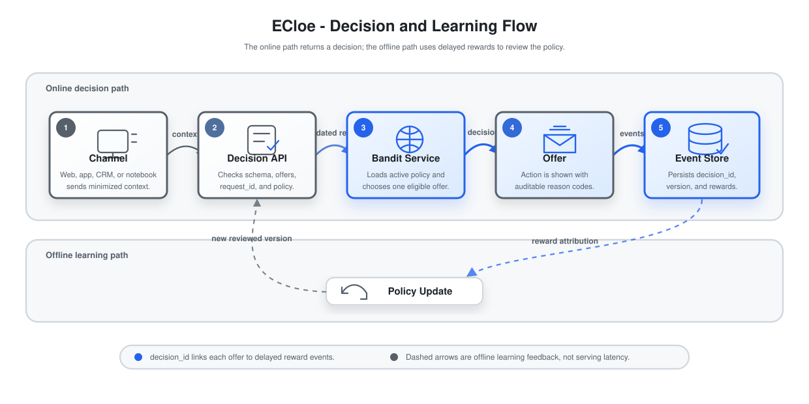
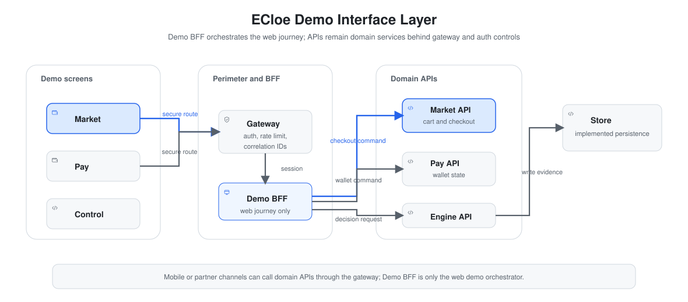
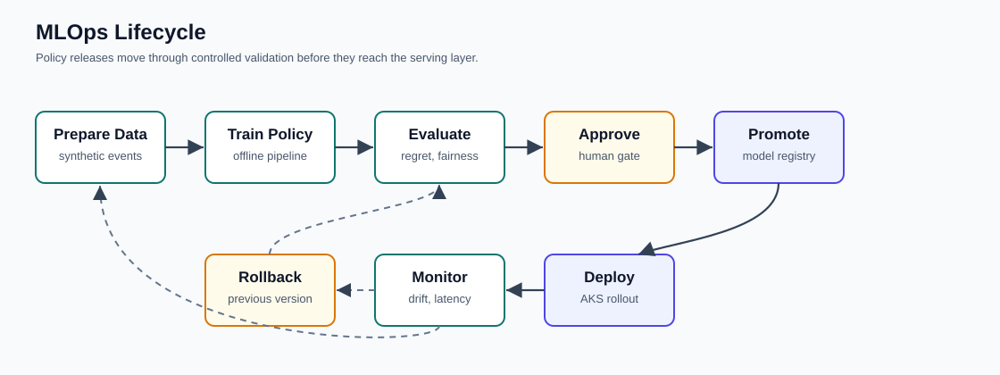
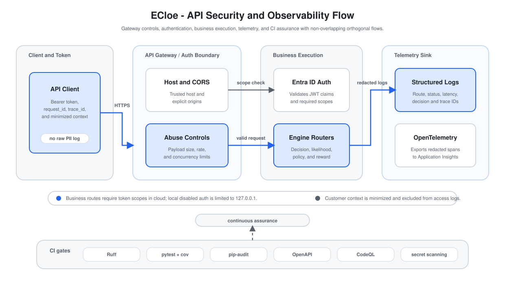
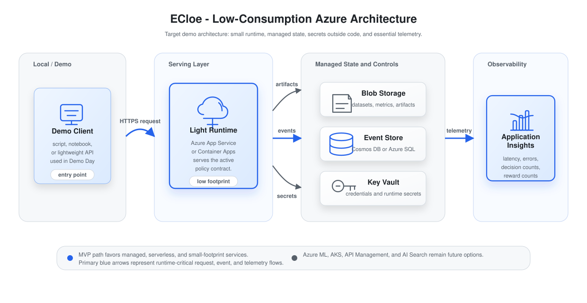

# Architecture - ECloe

ECloe is a low-cost adaptive experimentation MVP for next-best-action recommendations in an integrated marketplace and digital wallet ecosystem. The product story is composed of ECloe Market, ECloe Pay, and ECloe Engine. It currently contains Hillstrom data ingestion/processing code, offline policy evaluation, a lightweight purchase-likelihood validator, a local FastAPI service, validation reports, storage configuration shapes, tests, notebooks, and documentation for a future demo interface.

## Overview



The system starts with the public Kaggle Hillstrom email-campaign dataset, processes it into a minimized local dataset, evaluates multiple recommendation policies offline, and prepares the selected policy for a small demonstrable interface. Hillstrom is used as a public proxy for the pattern ECloe needs: context, action, and reward. In the target product, ECloe Market produces commerce behavior signals, ECloe Pay provides wallet context and eligible actions, ECloe Engine selects one next best action, the decision is logged, and later rewards are linked back to the original `decision_id`.

## Planned Demo Interface Layer



The planned interface layer is documentation-only at this stage. It should demonstrate the ECloe journey as one simulated web application composed of ECloe Market, ECloe Pay, and ECloe Control Room, while ECloe Engine remains an independent implemented API.

| Layer | Status | Responsibility |
|:---|:---|:---|
| Demo frontend | Planned for demo | Presents the launcher, marketplace, checkout recommendation, wallet, summary, and technical Control Room screens. |
| Demo Backend-for-Frontend | Planned for demo | Holds demo session state, aggregates raw UI events into minimized context, simulates upstream eligibility, and calls ECloe Engine. |
| Context aggregation | Planned for demo | Converts raw marketplace actions into coarse fields such as `channel`, `history_segment`, and `newbie`. |
| Eligibility simulation | Planned for demo | Produces eligible offers before the decision request. ECloe Engine must not invent eligibility. |
| ECloe Engine | Implemented | Serves health, policy metadata, likelihood estimates, decisions, and reward ingestion through `src/api/`. |
| Decision and reward persistence | Implemented | Persists decisions and reward events through the configured repository mode. |
| ECloe Control Room | Planned for demo | Explains request/response payloads, policies, artifacts, event timelines, and operational status for evaluators. |

Current implemented architecture is the local ECloe Engine API, offline evaluation pipeline, purchase-likelihood artifact, and persistence layer. Planned demo architecture adds the simulated UI and BFF around that API. Future production integration would replace the simulated eligibility and session layers with governed upstream marketplace, wallet, risk, compliance, and operations systems.

The planned interface is detailed in [`docs/demo-interface.md`](docs/demo-interface.md). It explicitly separates the current online serving strategy from the offline promoted policy and future adaptive strategies.

## Components

| Component | Responsibility | Key files/paths |
|:---|:---|:---|
| Configuration | Loads local `.env` settings, data paths, Kaggle dataset slug, file names, seed, and Azure placeholders. | `src/core/config.py`, `.env.example` |
| ECloe Market | Planned simulated marketplace surface for product browsing, cart, checkout, and purchase-habit signals. | Planned `src/demo/` |
| ECloe Pay | Planned simulated digital wallet surface for payment context, benefits, and eligible financial actions. | Planned `src/demo/` |
| ECloe Engine | Adaptive decision layer that ranks eligible offers using marketplace-finance context and simulated conversion likelihood. | `src/bandits/`, `src/evaluation/`, `src/engine/` |
| Local Engine API | Exposes the implemented health, policy, purchase-likelihood, and decision endpoints. | `src/api/` |
| Data ingestion | Downloads the configured Hillstrom Kaggle dataset into `data/raw/hillstrom.csv`. | `src/data/download.py` |
| Data schema | Defines accepted source columns, minimized context columns, allowed actions, rewards, and blocked columns. | `src/data/schemas.py` |
| Data processing | Normalizes columns, validates required fields, maps `segment -> action`, maps `conversion -> reward`, removes blocked modeling fields, and writes processed CSV output. | `src/data/process.py`, `tests/test_data_process.py` |
| Data validation | Produces `reports/data_validation.json` with missing values, duplicate count, action distribution, conversion rate, blocked columns, and validity status. | `src/data/validate.py`, `tests/test_data_validate.py` |
| Storage contracts | Defines target Azure settings and Cosmos DB document shapes for future decision/reward storage. | `src/storage/` |
| Offline policy layer | Implements Baseline, Epsilon-Greedy, UCB, and Thompson Sampling evaluation. | `src/bandits/`, `src/evaluation/` |
| Notebooks | Reproduce the essential data, validation, training, evaluation, and cloud-reference stages. | `notebooks/` |
| Marketplace-finance demo | Planned app simulation showing ECloe Market behavior, ECloe Pay context, eligible offers, recommendations, and reward events. | `docs/demo-interface.md` |
| Documentation | Central delivery documentation, diagrams, contracts, governance, model card, and demo script. | `README.md`, `docs/` |

## Data / ML Pipeline Flow



The MVP pipeline is intentionally small:

1. Download the Kaggle Hillstrom email-campaign dataset.
2. Process the dataset into minimized context, action, and reward columns.
3. Validate that no blocked columns are present in the processed dataset.
4. Interpret the rows as a public proxy for marketplace-finance context, eligible action, and reward.
5. Run the deterministic baseline and adaptive policies on the same offline sequence.
6. Write local policy metrics and artifacts under `reports/policy_training/`.
7. Train the lightweight purchase-likelihood validator.
8. Select the policy for the Golden Set and local Engine API.

## API Security and Observability



The API runtime now has an explicit operational perimeter. Business routes validate Microsoft Entra ID bearer tokens and route scopes in cloud environments, while local disabled authentication is limited to loopback execution. The middleware applies trusted host checks, explicit CORS origins, payload limits, request rate limits, and concurrency limits before the route handler executes.

Every request emits structured telemetry with `request_id`, `trace_id`, route, status, latency, and safe decision metadata such as `decision_id` and `policy_version` when available. Full `customer_context` payloads are intentionally excluded from access logs. OpenTelemetry instrumentation can export traces to Application Insights when the optional observability dependencies and connection string are configured.

Continuous assurance is enforced through CI gates for Ruff, pytest with coverage, dependency audit, OpenAPI compatibility, CodeQL, and secret scanning.

## Target Azure Architecture



The target cloud architecture keeps the MVP low-consumption:

| Layer | MVP option | Role |
|:---|:---|:---|
| Runtime | Azure App Service or Azure Container Apps | Runs a future script-backed API or lightweight FastAPI service. |
| Artifacts | Azure Blob Storage | Stores processed datasets, Golden Set files, metrics, and policy artifacts. |
| Events | Cosmos DB Serverless or small PostgreSQL | Stores decision events, reward events, and policy versions. |
| Secrets | Azure Key Vault | Keeps Kaggle, storage, and runtime credentials outside code. |
| Observability | Application Insights | Tracks latency, error rate, decision count, and reward count. |

AKS, Azure Machine Learning, API Management, and Azure AI Search are future enterprise options. They should not block the Datathon MVP.

The current Cosmos DB Serverless setup is documented in [`docs/cloud-setup.md`](docs/cloud-setup.md).

## API and Event Contracts

The implemented local Engine API, planned reward payloads, and privacy boundaries are documented in [`docs/api-contract.md`](docs/api-contract.md). The practical marketplace-finance scenario is documented in [`docs/marketplace-finance-use-case.md`](docs/marketplace-finance-use-case.md). The MVP includes local policy training and purchase-likelihood artifact generation documented in [`docs/training-workflow.md`](docs/training-workflow.md).

## Key Design Decisions

- **Local-first execution** - keeps the project easy to run and avoids unnecessary cloud cost during the Datathon.
- **Public Kaggle data only** - avoids real customer data and makes the experiment reproducible.
- **Marketplace-finance framing** - positions ECloe as the decision layer connecting commerce behavior and digital wallet actions.
- **Named product surfaces** - ECloe Market and ECloe Pay make the demo concrete while ECloe Engine remains reusable.
- **Eligibility stays upstream** - ECloe only ranks actions already allowed by marketplace, wallet, risk, and compliance systems.
- **Minimized Hillstrom context** - keeps `history_segment` but drops raw monetary `history` and `zip_code` from the modeling dataset.
- **Explicit action/reward mapping** - uses `segment` as the observed campaign action and `conversion` as the binary reward.
- **Compare policies instead of merging them** - Baseline, Epsilon-Greedy, UCB, and Thompson Sampling are evaluated as separate strategies.
- **Use Thompson Sampling as the initial candidate** - it fits binary rewards and handles uncertainty with documented Beta priors.
- **Separate serving from offline promotion** - `/v1/policies/current` is the source of truth for the online serving strategy, while offline artifacts document the promoted policy for review.
- **Estimate likelihood lightly** - purchase probability uses smoothed offline conversion rates and fallbacks instead of a heavy classifier.
- **Keep cloud as a target architecture** - small Azure services are enough for a demo; enterprise services remain future work.

## Project Structure

```text
.
├── data/
│   ├── raw/              # Original Kaggle files, ignored by git
│   ├── processed/        # Cleaned datasets, ignored by git
│   └── golden_set/       # Simplified evaluation cases
├── docs/                 # SVG diagrams and supporting documentation
├── notebooks/            # Reproducible notebooks for each essential stage
├── reports/              # Reports, metrics, and experiment outputs
├── src/
│   ├── api/              # Local FastAPI surface for ECloe Engine
│   ├── bandits/          # Offline decision policies
│   ├── core/             # Settings and environment variable loading
│   ├── data/             # Kaggle download, schema, processing, and validation
│   ├── engine/           # Purchase likelihood and decision services
│   ├── evaluation/       # Policy training and report generation
│   └── storage/          # Azure settings and expected document shapes
├── tests/                # Automated tests
├── Architecture.md       # Detailed architecture and pipeline documentation
├── pyproject.toml        # Dependencies and package configuration
├── .env.example          # Environment variable template
└── README.md             # Central project documentation
```

## Limitations

- The repository does not yet include MLflow runs or a full marketplace-finance user interface.
- The target Azure services are architectural guidance, not deployed infrastructure.
- Offline simulation is useful for engineering validation, but it is not production evidence.
- Purchase likelihood is based on public proxy data and should not be interpreted as real banking purchase propensity.
- A regulated production deployment would require legal, security, privacy, model risk, and operational reviews.
