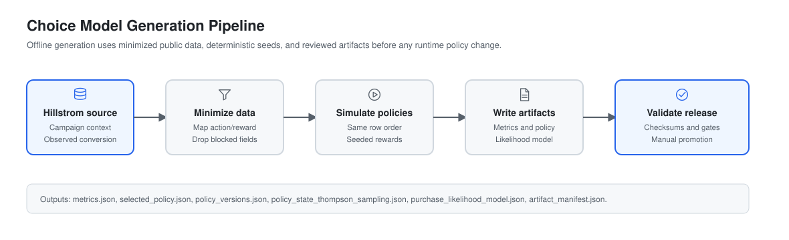
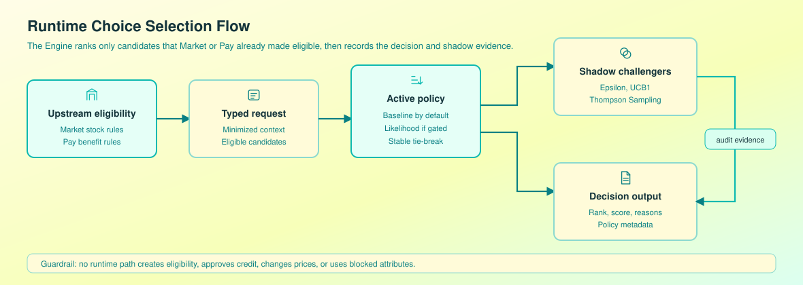
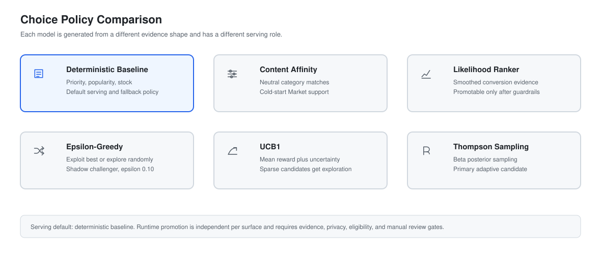

# Choice Model Generation

This document explains how each ECloe choice model is generated, evaluated, selected, and constrained. It complements [`recommendation-system.md`](recommendation-system.md), which remains the complete operating specification for API contracts, feature catalogs, privacy controls, training gates, and rollback.

ECloe treats "choice model" as the ranking policy used to select one or more eligible candidates. The current implementation includes deterministic rankers, a likelihood ranker, and adaptive bandit challengers. They are compared offline and guarded at runtime; they are not merged into a single classifier.

## Generation Pipeline

The generation flow starts with the public Hillstrom email-campaign dataset. The local data process maps source treatment labels into neutral actions, maps observed conversion into binary reward, and removes blocked fields before training or evaluation. The output is a minimized sequence of rows with context, action, and reward.

Offline evaluation uses logged outcomes and behavior propensities, not rewards generated from the model being evaluated. Data is ordered by decision time and split into 70% train, 15% validation, and 15% test. Doubly Robust is the primary estimator; IPS and SNIPS are diagnostics. The seeded simulator remains available only for synthetic demonstrations and can never authorize promotion.

Important generation files:

| Concern | Files |
|:---|:---|
| Source normalization | `src/data/legacy_hillstrom.py`, `src/data/process.py`, `src/data/schemas.py` |
| Offline policy generation | `src/evaluation/run.py`, `src/bandits/policies.py` |
| Runtime ranking strategies | `src/recommendation/strategies.py`, `src/recommendation/service.py` |
| Likelihood artifact | `src/engine/likelihood.py`, `reports/policy_training/purchase_likelihood_model.json` |
| Validation | `src/evaluation/validate_artifacts.py`, `tests/test_recommendation_service.py` |

## Runtime Selection

At runtime, Market or Pay sends only candidates that upstream domain logic has already made eligible. ECloe Engine validates the typed request, rejects unknown or blocked context, filters technical candidate availability, and ranks the remaining candidates with the active policy for that surface.

The active serving default is `deterministic_baseline`. `likelihood_ranker` can be requested by configuration but is guarded until minimum evidence exists. Epsilon-Greedy, UCB1, and Thompson Sampling are shadow challengers in the first governed release: they rank the same eligible set for evidence, but they do not change what the user sees.

The decision response includes ordered candidates, scores, confidence labels, reason codes, selected policy metadata, artifact metadata, warnings, and shadow ranking identifiers where configured.

## Policy Comparison

| Policy | How it is generated | Score or update | Evidence and artifact | Serving role |
|:---|:---|:---|:---|:---|
| Deterministic Baseline | Built directly from candidate attributes supplied in each request. | `priority * 0.01 + popularity_score + stock_score * 0.001`; ties sort by `candidate_id`. | No learned artifact; uses request candidates only. | Default serving policy and final fallback for Market and Pay. |
| Content Affinity | Generated from neutral `category_affinities` in context and candidate `category_id`. | `category_match + baseline_score * 0.01`. | No trained artifact; uses allowlisted category context. | Market cold-start support and fallback inside likelihood ranking. |
| Likelihood Ranker | Generated from verified binary outcomes aggregated by full context, reduced context, candidate, category, and global totals. | `(successes + alpha * global_rate) / (count + alpha)`, with `alpha=2`. | `purchase_likelihood_model.json` and `RecommendationEvidence`. | Promotable serving policy only after evidence guardrails pass. |
| Epsilon-Greedy | Offline bandit state is updated one reward at a time; runtime ranker wraps a base ranking. | Choose best with `1 - epsilon`; otherwise explore a seeded random eligible candidate. | Counts and mean values in offline state; runtime uses request-seeded exploration. | Shadow challenger; future canary capped below production exploration limits. |
| UCB1 | Offline bandit state accumulates counts and mean rewards per action; runtime ranker uses candidate evidence. | `mean_reward + sqrt(confidence * log(total) / count)`, with confidence `2.0`. | Candidate counts and rewards; unseen candidates receive a high uncertainty bonus. | Shadow challenger for uncertainty-aware exploration. |
| Thompson Sampling | Offline state tracks Beta posterior parameters per action; runtime samples per candidate. | `sample ~ Beta(1 + successes, 1 + failures)`. | Success and failure counts; prior is `Beta(1,1)` for sparse candidates. | Primary adaptive challenger after shadow and canary review. |

## Model Details

### Deterministic Baseline

The deterministic baseline is generated without training. It ranks the eligible candidates already supplied by Market or Pay using controlled business priority and, for Market products, popularity and stock bands. This makes it stable, explainable, and usable when artifacts are missing or evidence is insufficient.

Fallback behavior is built in: if no other policy is allowed to serve, the baseline ranks the candidates. Its main risk is concentration, because high-priority candidates can dominate exposure. Coverage and concentration must be monitored.

### Content Affinity

Content affinity is generated from neutral category signals, not identity or raw history. A category match receives the main score, while a small baseline component preserves deterministic order among similar candidates.

This model is useful for anonymous or low-evidence Market journeys. It is not used as an initial Pay policy because Pay benefit ranking relies on configured eligibility and priority rather than product categories.

### Likelihood Ranker

The likelihood ranker is generated from binary reward evidence. Training aggregates outcomes by the most specific safe context available, then by reduced context, candidate, category, and global surface evidence. Bayesian smoothing pulls small cohorts toward the global rate to reduce noisy estimates.

Confidence is low below 10 samples, medium from 10 to 49 samples, and high from 50 samples. Runtime promotion requires at least 1,000 decisions and 100 positive terminal outcomes per surface, plus privacy, calibration, eligibility, and review gates. Its main risks are delayed outcomes, selection bias, and weak calibration in sparse cohorts.

### Epsilon-Greedy

The offline Epsilon-Greedy model starts with zero counts and values for each action. On each simulated round it either explores a random action with probability `epsilon=0.10` or exploits the best current value estimate. After reward is observed, it updates the chosen action mean incrementally.

The runtime ranker wraps the base likelihood ranking and uses a request-derived seed so shadow choices are reproducible for the same request. It is useful for validating simple exploration behavior, but it can expose weaker candidates and should remain capped in any canary.

### UCB1

UCB1 is generated from action counts, mean rewards, and total observations. It ranks by observed mean plus an uncertainty bonus, so candidates with little evidence get a chance to be explored. In offline evaluation, untried actions are selected before score calculation.

The runtime ranker assigns unseen candidates a high uncertainty bonus in shadow evaluation. Its main risk is over-prioritizing sparse candidates when traffic is non-stationary or reward attribution is delayed.

### Thompson Sampling

Thompson Sampling is generated from success and failure counts using a Beta posterior. Each action starts with the `Beta(1,1)` prior. Reward `1` increments alpha; reward `0` increments beta. Selection samples one value per candidate and ranks by the sampled value.

The implementation uses deterministic seeds for reproducibility in local evaluation and request-seeded samples at runtime. Thompson Sampling is the primary adaptive challenger because it naturally balances uncertainty and observed reward, but it depends heavily on clean terminal outcomes and correct propensity metadata.

## Selection and Constraints

Offline selection uses `src/evaluation/run.py` and chooses the policy with the highest validation DR value, subject to overlap, propensity, calibration, and coverage gates. The frozen policy is evaluated once on the final test window. The selected policy is written to `selected_policy.json` for human review; it is not automatic production approval.

Runtime policy selection is independent per surface through configuration. Only `deterministic_baseline` and guarded `likelihood_ranker` are serving candidates in the current implementation. Bandit challengers are used for shadow rankings until a reviewed batch release approves a new serving strategy.

Hard constraints:

- Eligible candidates must come from Market, Pay, risk, compliance, or other upstream owners.
- ECloe Engine must not create eligibility, approve credit, change prices, or process real money.
- Blocked attributes such as sex, gender, direct identifiers, balance, income, credit score, precise location, and raw histories must not enter features or artifacts.
- Feedback is recorded immediately, but serving state changes only through reviewed batch releases.
