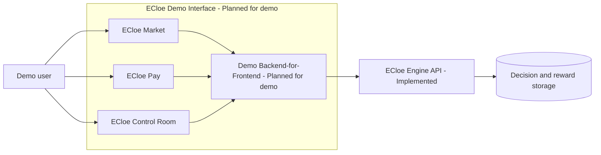
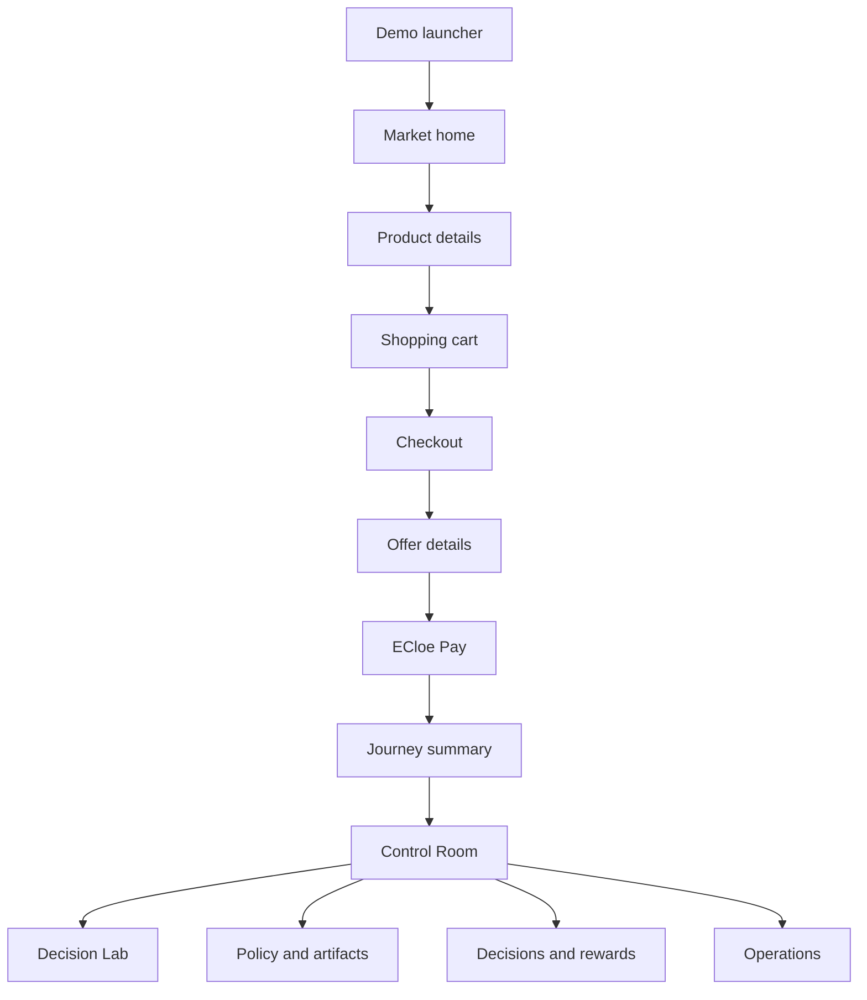
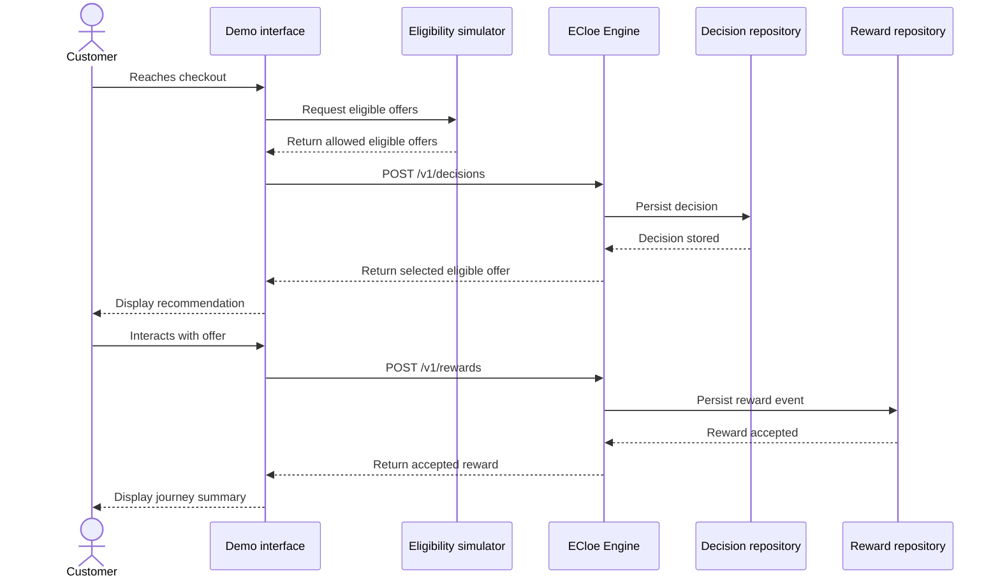

# Demo Interface - ECloe

## Status

| Area | Status | Notes |
|:---|:---|:---|
| ECloe Demo web application | Planned for demo | One simulated web application with ECloe Market, ECloe Pay, and ECloe Control Room. |
| Demo Backend-for-Frontend | Planned for demo | Recommended integration layer for session state, context aggregation, and eligibility simulation. |
| ECloe Engine API | Implemented | Existing FastAPI service with health, policy, likelihood, decision, and reward routes. |
| Administrative read endpoints | Future | Needed for event timelines and operations dashboards. |
| Credit, fraud, risk, compliance, and eligibility decisions | Out of scope | These remain upstream responsibilities and are not performed by ECloe Engine. |

## Demo Objective

The demo interface should show the complete marketplace-finance journey around the existing ECloe Engine API. A deterministic persona interacts with ECloe Market, the demo layer aggregates coarse context, an upstream eligibility simulator produces eligible offers, ECloe Engine selects one eligible offer, and a reward event is registered after the user interacts with the recommendation.

ECloe Engine does not approve credit, loans, limits, eligibility, fraud decisions, risk decisions, or regulated financial products. It only chooses one action from the eligible offers received in the request.

## Product Narrative

```text
Demo persona
    ↓
ECloe Market interaction
    ↓
Context aggregation
    ↓
Upstream eligibility simulation
    ↓
ECloe Engine decision
    ↓
Recommended offer displayed
    ↓
ECloe Pay or offer interaction
    ↓
Reward event
    ↓
Technical journey summary
```

The customer-facing story is simple: a simulated marketplace user reaches checkout and sees one relevant ECloe Pay benefit. The technical story is explicit: only minimized context and eligible offers reach ECloe Engine, reward registration is append-only, and the recorded reward becomes available for future offline policy evaluation. The interface must not imply immediate online learning or instant model retraining after every reward event.

## Interface Architecture

The interface is documented as one web application with three main areas:

```text
ECloe Demo
├── ECloe Market
├── ECloe Pay
└── ECloe Control Room
```

ECloe Engine remains an independent API consumed by the demo application.

ECloe Market and ECloe Pay have dedicated documentation in [`ecloe-market.md`](ecloe-market.md) and [`ecloe-pay.md`](ecloe-pay.md). This interface document keeps the full demo journey together, while those documents own marketplace screens, wallet screens, domain boundaries, data contracts, event flows, and Azure direction for each surface.



Visual SVG companion: [`demo-interface-flow.svg`](demo-interface-flow.svg).

## Screen Navigation



## Decision and Reward Sequence



## Demo Personas

| Persona | Simulated behavior | Aggregated context | Eligible offers | Expected recommendation scenario | Expected reward scenario |
|:---|:---|:---|:---|:---|:---|
| New customer | Browses categories and reaches checkout for the first time. | `channel=Web`, low `history_segment`, `newbie=1` | `financial_education`, `savings_goal` | Low-risk onboarding benefit. | Click or dismissal. |
| Recurring marketplace customer | Adds a recurring-purchase product to cart. | `channel=Web`, mid `history_segment`, `newbie=0` | `cashback_recurring_purchase`, `savings_goal`, `financial_education` | Cashback benefit at checkout. | Conversion after viewing offer. |
| High-value cart customer | Builds a larger cart and opens checkout. | `channel=Multichannel`, higher `history_segment`, `newbie=0` | `cashback_recurring_purchase`, `installment_education`, `financial_education` | Checkout benefit or education message. | Click or conversion. |
| Low wallet engagement customer | Uses the marketplace but rarely opens ECloe Pay. | `channel=Phone`, low `history_segment`, `newbie=0` | `savings_goal`, `financial_education` | Wallet engagement benefit. | Click only. |
| Highly engaged digital customer | Uses ECloe Market and ECloe Pay frequently. | `channel=Web`, higher `history_segment`, `newbie=0` | `cashback_recurring_purchase`, `savings_goal`, `premium_benefit` | Highest validated eligible benefit. | Conversion. |

No persona uses real personal data.

## Screen Flows and API Calls

| Screen | Route | Status | Purpose | API calls | Success state | Loading state | Empty state | Error state | Fallback state |
|:---|:---|:---|:---|:---|:---|:---|:---|:---|:---|
| Demo launcher | `/demo` | Planned for demo | Select deterministic scenario and mode. | None or BFF session create. | Session ID and seed created. | Start button disabled while session starts. | No persona selected. | Invalid scenario configuration. | Default recurring customer scenario. |
| ECloe Market home | `/market` | Planned for demo | Simulate marketplace browsing. Detailed in [`ecloe-market.md`](ecloe-market.md). | BFF session state only. | Categories, cards, cart, and recommendation area shown. | Product cards skeleton. | Empty cart or no recommendation yet. | Demo connection unavailable. | Continue in offline presentation mode. |
| Product details | `/market/products/{product_id}` | Planned for demo | Add products and show wallet preview. Detailed in [`ecloe-market.md`](ecloe-market.md). | BFF state update only. | Item added to cart. | Product details skeleton. | Product not found in demo catalog. | Add-to-cart failure. | Keep previous cart state. |
| Cart | `/market/cart` | Planned for demo | Review selected products and payment method. Detailed in [`ecloe-market.md`](ecloe-market.md). | Eligibility simulator through BFF. | Eligible offers snapshot created. | Eligibility snapshot loading. | Empty cart. | Eligibility simulation failure. | Deterministic eligible offers for the selected persona. |
| Checkout | `/market/checkout` | Planned for demo | Main decision screen. Detailed in [`ecloe-market.md`](ecloe-market.md). | `POST /v1/decisions`; optional `POST /v1/likelihood-estimates`. | Selected eligible offer displayed. | Recommendation placeholder. | No eligible offer. | Engine unavailable or invalid request. | Deterministic safe message from demo layer. |
| Recommendation card | Inside checkout | Planned for demo | Present selected eligible offer. | Uses checkout decision response. | Customer-facing card shown. | Card placeholder. | No eligible offer selected. | Missing decision response. | Hide technical details and show neutral message. |
| Offer details | `/offers/{offer_id}` | Planned for demo | Accept, dismiss, or return from offer. | `POST /v1/rewards` after verified demo action. | Reward event accepted. | Reward submit progress. | Unknown offer ID. | Reward rejected. | Keep decision and show retry option. |
| ECloe Pay | `/pay` | Planned for demo | Show simulated wallet and accepted offer status. Detailed in [`ecloe-pay.md`](ecloe-pay.md). | BFF session state; reward status from prior call. | Wallet benefits and accepted offer status shown. | Wallet summary skeleton. | No accepted offer. | Session lookup failure. | Static wallet demo view. |
| Demo summary | `/demo/summary` | Planned for demo | Show full technical journey. | BFF timeline read. | Timeline with request, decision, event, policy, and latency. | Timeline loading. | No recorded events. | Timeline unavailable. | Locally reconstructed summary from session state. |
| Decision Lab | `/engine/lab` | Planned for demo | Developer/evaluator API exploration. | `POST /v1/likelihood-estimates`, `POST /v1/decisions`. | Request and response JSON shown. | Request in progress. | No request history. | Structured API error shown. | Use sample payload. |
| Policy and artifacts | `/engine/policies` | Planned for demo | Separate online serving strategy from offline promoted policy. | `GET /v1/policies/current`. | Current serving strategy and promoted offline policy shown separately. | Policy metadata loading. | Artifact missing. | Artifact unavailable. | Show documentation-only explanation. |
| Decisions and rewards | `/engine/events` | Future | Inspect decision and reward timelines. | Future internal read endpoints only. | Filtered event timeline. | Timeline loading. | No events. | Read endpoint unavailable. | Explain endpoint dependency. |
| Operations | `/engine/operations` | Planned for demo | Show liveness, readiness, telemetry, and fallback counters. | `GET /livez`, `GET /readyz`; telemetry source when available. | Health and basic operational counters shown. | Health checks loading. | No telemetry yet. | Health check failed. | Presentation mode status panel. |

## Checkout Decision Integration

Before checkout calls ECloe Engine, the simulated upstream layer calculates eligible offers:

```json
{
  "eligibility_snapshot_id": "elig_demo_001",
  "eligible_offers": [
    "cashback_recurring_purchase",
    "savings_goal",
    "financial_education"
  ]
}
```

ECloe Engine must not invent eligibility. The decision call uses the existing API contract:

```http
POST /v1/decisions
Idempotency-Key: demo-session:checkout:interaction
X-Request-Id: req_demo_001
```

```json
{
  "request_id": "req_demo_001",
  "customer_context": {
    "channel": "Web",
    "history_segment": "2) $100 - $200",
    "newbie": 0
  },
  "eligible_offers": [
    "cashback_recurring_purchase",
    "savings_goal",
    "financial_education"
  ]
}
```

The idempotency key should be generated from the demo session, screen, and interaction name. A duplicate checkout submission with the same authenticated subject and `Idempotency-Key` returns the original persisted decision instead of creating a duplicate decision event. The interface retains the returned `decision_id` in demo session state so the offer interaction can register a reward event later.

Customer-facing mode must not display artifact checksums, internal proxy actions, raw reason codes, internal request payloads, or internal policy configuration.

## Recommendation Card

Customer-facing example:

```text
Earn cashback on your recurring purchases.

You are eligible for this ECloe Pay benefit.

[View benefit] [Not now]
```

Technical mode may display selected offer, eligible offers considered, executed policy, policy version, simulated purchase likelihood, reason codes, artifact version, decision ID, request ID, and request latency. Any probability must be labeled as a simulated estimate based on public proxy data, not proof of real customer intent.

## Offer Interaction and Reward Event

| User action | Event type | Demo reward |
|:---|:---|---:|
| Open offer | `click` | `0.2` |
| Dismiss offer | `dismissal` | `0.0` |
| Accept offer | `conversion` | `1.0` |

In a real integration, the frontend must not define arbitrary reward values. Trusted backend services must map verified business events to configured reward values.

Example reward request:

```http
POST /v1/rewards
```

```json
{
  "decision_id": "dec_demo_001",
  "event_id": "evt_demo_001",
  "event_type": "conversion",
  "reward": 1.0,
  "occurred_at": "2026-07-26T12:00:00Z"
}
```

After a reward is accepted, ECloe Pay may display:

```text
The interaction was recorded and will be available for future policy evaluation.
```

It must not display messages suggesting immediate model retraining or immediate online learning.

## Presentation Mode

| Element | Status | Behavior |
|:---|:---|:---|
| Deterministic seed | Planned for demo | Keeps persona, cart, eligible offers, and expected reward stable. |
| Guided navigation | Planned for demo | Moves from launcher to Market, checkout, offer, Pay, summary, and Control Room. |
| Customer-facing copy | Planned for demo | Hides internal payloads and technical policy configuration. |
| Fallback cards | Planned for demo | Allows the presenter to continue if the local Engine API is unavailable. |

## Technical Mode

Technical mode is intended for developers, evaluators, and presentation judges. It may show:

- raw UI event;
- aggregated signal;
- validated ECloe context;
- eligible offers;
- request JSON;
- response JSON;
- decision ID;
- event ID;
- online serving strategy;
- offline promoted policy;
- artifact metadata;
- request latency.

Example mapping:

```text
Raw event:
Product added to cart.

Aggregated signal:
Recurring category interaction.

Context sent to Engine:
Coarse history segment and customer status.
```

## Data Minimization Boundaries

| Data class | Sent to ECloe Engine? | Status | Notes |
|:---|:---|:---|:---|
| `channel` | Yes | Implemented | Allowed serving field. |
| `history_segment` | Yes | Implemented | Coarse proxy segment only. |
| `newbie` | Yes | Implemented | Small categorical serving signal. |
| Eligible offers | Yes | Implemented | Already allowed upstream. |
| Raw item-level browsing history | No | Out of scope | Remains in the demo layer. |
| Exact cart contents | No | Out of scope | Aggregated before the decision call. |
| Raw account balance | No | Out of scope | Wallet UI may simulate it locally only. |
| Direct identifiers | No | Out of scope | Demo uses session IDs and generated request IDs. |
| Credit score, risk, fraud, compliance state | No | Out of scope | These systems only influence upstream eligibility. |

## Policy Status Boundaries

| Concept | Status | How to present it |
|:---|:---|:---|
| Online serving strategy | Implemented | Current runtime strategy returned by `/v1/policies/current`; currently `likelihood_ranker` when the serving artifact is loaded. |
| Offline promoted policy | Implemented | Offline evaluation candidate stored in local policy artifacts and returned separately by the policy endpoint. |
| Future adaptive online strategies | Future | May be discussed as future work only. |
| Immediate learning after every reward | Out of scope | Reward events are recorded for future evaluation; they do not trigger instant online learning. |

## Future Internal Read Endpoints

These endpoints may support ECloe Control Room later, but they are not currently implemented:

```text
GET /internal/v1/decisions
GET /internal/v1/decisions/{decision_id}
GET /internal/v1/rewards
GET /internal/v1/sessions/{session_id}/timeline
```

## Current Implementation Versus Planned Interface Features

| Feature | Status | Notes |
|:---|:---|:---|
| FastAPI ECloe Engine | Implemented | Existing local API in `src/api/`. |
| Decision creation | Implemented | `POST /v1/decisions` persists a decision and returns the selected eligible offer. |
| Reward ingestion | Implemented | `POST /v1/rewards` persists append-only reward events linked to a decision. |
| Policy metadata | Implemented | `GET /v1/policies/current` separates serving policy and promoted offline policy metadata. |
| Likelihood estimates | Implemented | `POST /v1/likelihood-estimates` estimates simulated conversion probability. |
| ECloe Market UI | Planned for demo | No frontend code exists in the repository. Dedicated scope is documented in [`ecloe-market.md`](ecloe-market.md). |
| ECloe Pay UI | Planned for demo | No frontend code exists in the repository. Dedicated scope is documented in [`ecloe-pay.md`](ecloe-pay.md). |
| ECloe Control Room UI | Planned for demo | Depends on demo UI and future internal read surfaces. |
| Demo Backend-for-Frontend | Planned for demo | Recommended for session state, aggregation, and eligibility simulation. |
| Production financial integration | Future | Requires real governance, security, legal, privacy, and model-risk review. |
