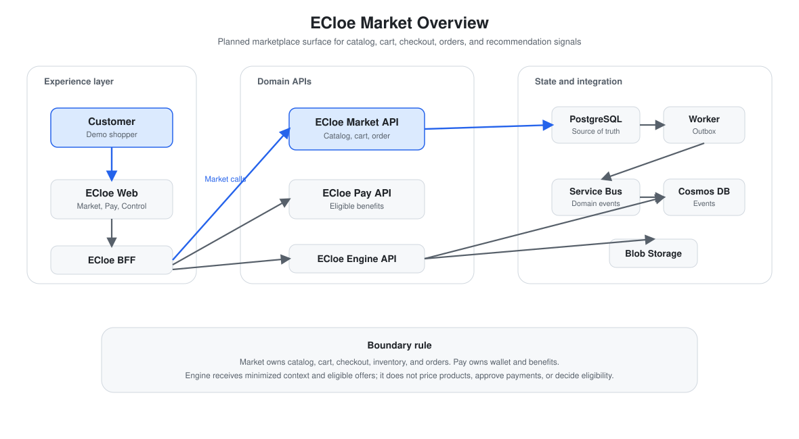
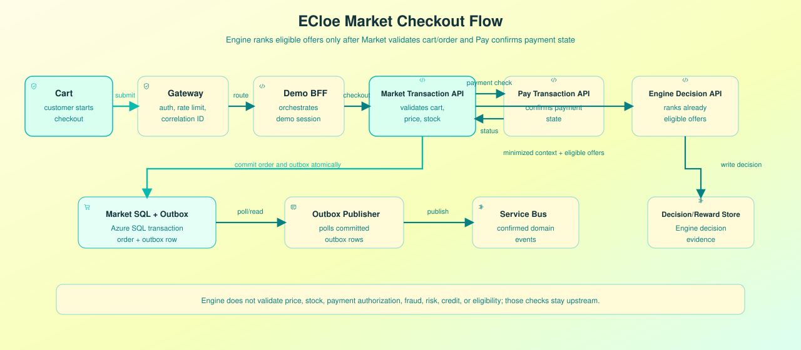
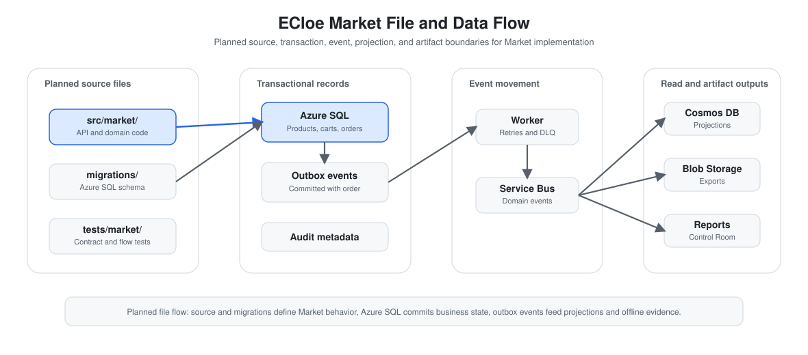
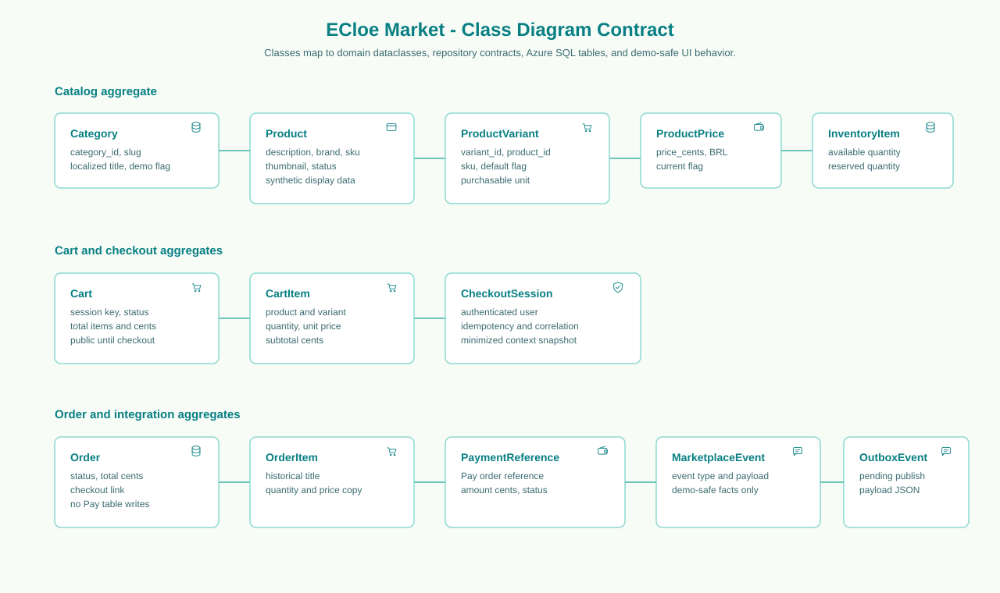

# ECloe Market - Marketplace Surface

## Status

| Area | Status | Notes |
|:---|:---|:---|
| ECloe Market product surface | Implemented | Shared Flask demo route, public `/market` surface, filters, sort controls, product grid, product detail page, and synthetic-data notices. |
| Catalog APIs | Implemented | Local normalized catalog, categories, product listing, product detail APIs, product variants, current prices, stock, and deterministic seed script. |
| Cart, checkout, and order APIs | Planned for demo | Target API surface for marketplace behavior and transaction state. |
| Azure SQL catalog model | Implemented | `ecloe_market` schema, catalog/price/stock tables, idempotent seed command, and runtime repository behind `ECLOE_MARKET_DATABASE_MODE=azure_sql`. |
| Azure SQL transaction model | Planned for demo | Future source of truth for carts, checkout, orders, payment references, and outbox records. |
| Recommendation integration | Planned for demo | Market/BFF aggregates context, gets eligible offers from upstream services, and calls ECloe Engine. |
| ECloe Engine API | Implemented | Existing FastAPI service for decisions, likelihood estimates, policy metadata, and reward ingestion. |
| Real payment processing, fraud, risk, credit, pricing automation, and eligibility decisions | Out of scope | These remain upstream responsibilities and are not performed by ECloe Market or ECloe Engine. |

## Purpose

ECloe Market is the marketplace surface for the ECloe ecosystem. The current implementation covers the shared demo entrypoint, public marketplace shell, local synthetic catalog, Azure SQL catalog persistence, category browsing, product listing, product details, variants, current prices, stock, demo cart, and catalog APIs. Browsing is public; the shared demo login is requested only when the user continues to checkout or reaches account-specific order views. If the user is already authenticated through ECloe Pay, Market reuses that account context.

The Market experience is a separate purchase-oriented surface. It may reuse ECloe Pay ecosystem assets such as the mascot, logo mark, and visual tokens, but the layout follows marketplace patterns: horizontal header, dominant search, category navigation, filtered result listings, product purchase panel, and cart summary. It must not copy third-party brand identity, text, CSS, or proprietary layout.

The current repository already implements ECloe Engine and ECloe Pay, and now includes the first ECloe Market demo foundation. This document keeps the full target Market scope so future implementation can stay aligned with the existing Engine API, privacy boundary, and low-consumption Azure direction.

## Architecture Diagrams

### Overview



The overview shows how Demo Web traffic crosses the API Gateway/Auth boundary into the Demo BFF and then into Market Transaction API, Pay Transaction API, and Engine Decision API. Azure SQL owns transactional Market state and the committed outbox row; the Outbox Publisher polls that table and publishes confirmed events to Service Bus.

### Checkout Flow



The checkout flow shows the planned order path: validate the cart, revalidate price and stock, confirm payment state through ECloe Pay, ask ECloe Engine to rank already eligible offers, and create the order plus outbox row in one Azure SQL transaction. Asynchronous event publication starts only when the Outbox Publisher reads committed rows and publishes to Service Bus.

### File and Data Flow



The file and data flow separates source files, migrations, Azure SQL transaction state, committed outbox rows, Outbox Publisher polling, Service Bus events, projection workers, Cosmos read models, and explicit Blob exports. Service Bus is a broker only; it does not write Blob Storage.

### Class Diagram



The class diagram is the implementation contract for the Market domain. Classes shown in the diagram must map to domain dataclasses, repository methods, Azure SQL tables where persistence is required, and static tests. The diagram separates catalog, cart, checkout, order, payment reference, marketplace event, and outbox responsibilities while preserving the rule that Market does not write Pay tables directly.

## Product Role

```text
ECloe Market behavior
    + ECloe Pay context
    -> eligible offers
    -> ECloe Engine decision
    -> next best eligible action
    -> customer interaction
    -> reward event
```

ECloe Market produces commerce intent signals such as category views, product views, cart additions, checkout start, recurrence, and order completion. These raw events must remain in the Market or BFF layer until they are converted into minimized context.

ECloe Engine does not price products, approve payments, check inventory, execute fraud screening, grant credit, or decide eligibility. It receives a request containing minimized context and already eligible offers, then ranks one action from that request.

## Target Capabilities

| Capability | Status | Notes |
|:---|:---|:---|
| Product catalog | Implemented | Deterministic local synthetic catalog, Azure SQL seed, category list, filtered product listing API, product detail API, and product screens. |
| Pricing | Implemented | Current synthetic price lookup in integer cents for public catalog and product detail. Historical order snapshots remain planned. |
| Inventory | Implemented | Available and reserved synthetic quantities in the catalog repository. Checkout reservation and concurrency protection remain planned. |
| Cart | Implemented | Public demo cart in memory mode with item add/remove and quantity update. Azure SQL cart persistence remains planned. |
| Checkout | Planned for demo | Cart snapshot, price revalidation, stock reservation, idempotency, and correlation ID. |
| Orders | Planned for demo | Order creation, order item snapshots, status changes, cancellation, and payment confirmation link. |
| Marketplace events | Planned for demo | Product and checkout events written through outbox for reliable async delivery. |
| Recommendation handoff | Planned for demo | Aggregated context and eligible offers are sent to ECloe Engine through the BFF. |
| Control Room evidence | Planned for demo | Technical timeline can show request, decision, order, payment, event, and fallback state. |

## Out of Scope

ECloe Market must not:

- process real payments;
- store card data;
- grant credit;
- perform fraud analysis;
- determine financial limits;
- let AI alter prices, stock, or eligibility;
- send full personal, financial, cart, or item-level browsing data to ECloe Engine.

## Persistence Decision

The recommended primary database for ECloe Market is **Azure SQL Database** with a low-consumption serverless or small service tier. The current implementation already provides the PR 2 catalog schema and runtime repository for `ECLOE_MARKET_DATABASE_MODE=azure_sql`; transaction tables for cart, checkout, orders, payment references, and outbox remain planned.

To initialize the PR 2 catalog schema and seed the local synthetic catalog into Azure SQL:

```bash
python -m scripts.init_ecloe_market_sql
```

Routine runtime access should remain schema-scoped, for example `GRANT SELECT, INSERT, UPDATE, DELETE ON SCHEMA::ecloe_market TO [<managed-identity-name-or-user-email>]`, without `db_owner`. Migration or validation identities may use broader privileges only during controlled setup.

The executable beta does not require Azure SQL. When `ECLOE_MARKET_DATABASE_MODE=memory`, the app reads `data/demo/ecloe_market_catalog.json` and serves local images from `src/demo/ecloe_market/assets/catalog/`.

The target product image dataset is Kaggle [`fatihkgg/ecommerce-product-images-18k`](https://www.kaggle.com/datasets/fatihkgg/ecommerce-product-images-18k). If the dataset is available locally, regenerate the beta catalog with one of:

```bash
python -m scripts.seed_ecloe_market_catalog --kaggle-dir data/external/ecommerce-product-images-18k
python -m scripts.seed_ecloe_market_catalog --kaggle-archive data/external/ecommerce-product-images-18k.zip
```

If the Kaggle files are not available, the same command without flags creates deterministic local product-image assets so the marketplace remains runnable.

Azure SQL is the source of truth for:

| Data group | Examples |
|:---|:---|
| Catalog | `categories`, `products`, `product_variants`, `product_prices` |
| Inventory | `inventory_items`, reserved quantities, inventory version |
| Cart | `carts`, `cart_items`, cart status and expiry |
| Checkout | checkout sessions, snapshots, idempotency keys, correlation IDs |
| Orders | `orders`, `order_items`, status, historical product snapshots |
| Promotions | market promotions and applied discounts |
| Integration | payment references, marketplace events, outbox events |

Azure SQL fits the Market domain because checkout requires relational constraints and atomic updates across cart validation, current price lookup, stock reservation, order creation, order items, checkout state, and outbox records.

If any checkout step fails, the Market transaction must roll back without leaving partial order or inventory state.

## Cosmos DB Role

Cosmos DB remains complementary for event-oriented records and denormalized reads. The current Engine-oriented containers are:

```text
decisions
rewards
policy_versions
```

Future Market projections may include:

```text
market_activity
personalized_feed
product_read_models
customer_journeys
```

Cosmos DB should not initially be the official source for stock, prices, orders, carts, payment status, or checkout status. Those records need transaction consistency that fits Azure SQL better for the first functional Market version.

## Domain Ownership

| Domain | Owns | Must not do |
|:---|:---|:---|
| ECloe Market | Products, variants, categories, prices, inventory, carts, cart items, checkout sessions, orders, order items, promotions, marketplace events. | Write directly to ECloe Pay tables or decide financial eligibility. |
| ECloe Pay | Wallets, ledger accounts, financial transactions, balances, benefits, benefit activations, payment orders. | Mutate Market catalog, stock, cart, or order tables directly. |
| ECloe Engine | Decisions, rewards, policy versions, model artifacts, evaluation metrics. | Access Market or Pay transactional tables directly or invent eligibility. |

Integration between domains should happen through APIs or events. Sharing an Azure SQL database for cost control does not mean sharing write ownership across schemas.

## Planned API Surface

### Catalog

```http
GET /v1/categories
GET /v1/products
GET /v1/products/{product_id}
GET /v1/products/{product_id}/variants
```

### Cart

```http
POST   /v1/carts
GET    /v1/carts/{cart_id}
PUT    /v1/carts/{cart_id}/items/{variant_id}
DELETE /v1/carts/{cart_id}/items/{variant_id}
```

### Checkout

```http
POST /v1/checkouts
GET  /v1/checkouts/{checkout_id}
POST /v1/checkouts/{checkout_id}/recommendation
```

### Orders

```http
POST /v1/orders
GET  /v1/orders
GET  /v1/orders/{order_id}
POST /v1/orders/{order_id}/payment-confirmation
POST /v1/orders/{order_id}/cancel
```

### Administration

```http
POST  /v1/admin/products
PATCH /v1/admin/products/{product_id}
POST  /v1/admin/products/{product_id}/variants
PUT   /v1/admin/inventory/{variant_id}
PUT   /v1/admin/prices/{variant_id}
```

Sensitive write operations should accept:

```http
Idempotency-Key: <unique-operation-id>
X-Correlation-Id: <uuid>
```

The API surface is planned and is not implemented in the current repository.

## Core Data Model

| Entity | Purpose | Notes |
|:---|:---|:---|
| `categories` | Groups products for browsing and navigation. | Supports the marketplace category view. |
| `products` | Product identity, description, attributes, and lifecycle status. | Flexible attributes can use Azure SQL JSON columns or normalized attribute tables. |
| `product_variants` | SKU-level purchasable units. | Variant-specific attributes and status. |
| `product_prices` | Time-bounded prices. | Applied order price must be copied into `order_items`. |
| `inventory_items` | Available and reserved quantity per variant. | Needs concurrency control during checkout. |
| `carts` | Customer cart state. | Not final evidence of price or availability. |
| `cart_items` | Selected variants and quantities. | Must be revalidated at checkout. |
| `checkout_sessions` | Checkout snapshot and recommendation context. | Links cart, order, eligibility, and decision evidence. |
| `orders` | Confirmed or pending order aggregate. | Uses idempotency and correlation IDs. |
| `order_items` | Historical product and price snapshots. | Preserves what was presented at purchase time. |
| `payment_references` | Link between Market order and ECloe Pay payment order. | Pay owns the payment order. |
| `outbox_events` | Reliable event publication records. | Written in the same Azure SQL transaction as business state. |

## Checkout Transaction

The central Market transaction should follow this shape:

```text
1. Validate idempotency key.
2. Re-read the cart.
3. Revalidate current price.
4. Lock and validate inventory.
5. Create order and order items.
6. Reserve inventory.
7. Create checkout or order event in outbox.
8. Commit all changes together.
```

If any step fails, the transaction rolls back. No partial order, stock reservation, or outbox event should remain.

## Recommendation Integration

The Market or BFF layer may derive an aggregated context from marketplace behavior:

```json
{
  "channel": "Web",
  "history_segment": "recurring_customer",
  "newbie": 0,
  "cart_value_segment": "medium",
  "category_affinity": "recurring_purchase",
  "wallet_engagement": "medium"
}
```

The current implemented Engine API accepts only the minimized serving fields documented in [`api-contract.md`](api-contract.md). Until the artifact and API allowlist are extended, the request to ECloe Engine should stay aligned with the current contract:

```json
{
  "request_id": "req_checkout_001",
  "customer_context": {
    "channel": "Web",
    "history_segment": "2) $100 - $200",
    "newbie": 0
  },
  "eligible_offers": [
    "cashback_recurring_purchase",
    "savings_goal",
    "financial_education"
  ]
}
```

Raw cart contents, complete products, direct identifiers, and payment details must not be sent to ECloe Engine.

## Events

Initial Market events:

| Event | Purpose |
|:---|:---|
| `ProductViewed` | Product detail interaction. |
| `ProductAddedToCart` | Cart engagement signal. |
| `ProductRemovedFromCart` | Cart update signal. |
| `CheckoutStarted` | Checkout funnel entry. |
| `CheckoutCompleted` | Checkout completion signal. |
| `OrderCreated` | Order aggregate was created. |
| `OrderConfirmed` | Payment confirmation was linked. |
| `OrderCancelled` | Order was cancelled or released. |
| `InventoryReserved` | Stock reservation happened. |
| `InventoryReleased` | Reserved stock was released. |
| `RecommendationDisplayed` | Engine-selected offer was shown. |
| `RecommendationAccepted` | Customer accepted the selected offer. |
| `RecommendationDismissed` | Customer dismissed the selected offer. |

Outbox events should include an event ID, aggregate type, aggregate ID, event type, event version, payload, occurrence timestamp, publication timestamp, and attempt counter.

## Data Sent to ECloe Engine

ECloe Market must not send:

- customer name;
- CPF or national identifier;
- address;
- email;
- payment data;
- wallet balance;
- full product list;
- detailed purchase descriptions;
- direct customer identifiers.

Allowed Engine-facing data is minimized and validated. Eligibility remains upstream, and ECloe Engine ranks only the eligible offers it receives.

## Security

The target architecture should use:

- Microsoft Entra ID or Entra External ID;
- Managed Identity between Azure services;
- Azure Key Vault;
- Azure SQL connections over TLS;
- Private Endpoint in protected environments;
- scope-based authorization;
- payload limits;
- rate limiting;
- administrative audit logs;
- logs without full personal, financial, or cart payloads.

Suggested scopes:

```text
catalog:read
catalog:write
cart:read
cart:write
checkout:write
order:read
order:write
inventory:read
inventory:write
```

Market should derive `customer_id` from the authenticated subject. A client must not be allowed to submit another customer's identifier directly.

Public catalog browsing does not require authentication. Authentication begins at checkout and for account-specific order views, using the same shared demo session as ECloe Pay.

## Observability

Each request should carry or emit:

```text
request_id
correlation_id
trace_id
customer_subject_key
route
status_code
duration_ms
```

Primary indicators:

```text
product_view_count
cart_created_count
cart_abandonment_rate
checkout_started_count
checkout_completed_count
order_created_count
order_confirmation_rate
inventory_conflict_count
recommendation_request_count
recommendation_acceptance_rate
engine_fallback_count
```

Logs must not contain tokens, credentials, card data, CPF, full address, or the complete user context payload.

## Azure Direction

For the MVP, the low-consumption direction is:

| Layer | Suggested service | Notes |
|:---|:---|:---|
| Frontend | Azure Static Web Apps | Hosts ECloe Web when a demo UI exists. |
| Runtime | Azure Container Apps | Runs Demo BFF, Market Transaction API, Pay Transaction API, Engine Decision API, and Outbox Publisher. |
| Transactions | Azure SQL Database | Market and Pay may share one low-consumption database with separate schemas for cost control. |
| Events | Azure Service Bus | Distributes confirmed domain events. |
| Event records and projections | Cosmos DB Serverless | Stores Engine decisions/rewards and future denormalized read models. |
| Secrets | Azure Key Vault | Stores credentials and service configuration. |
| Observability | Application Insights | Tracks latency, errors, fallback, funnel, and recommendation metrics. |
| Artifacts | Azure Blob Storage | Stores exports, reports, metrics, and training artifacts. |

Sharing Azure SQL infrastructure does not allow Market to write Pay-owned tables or Pay to write Market-owned tables.

## Implementation Sequence

| PR | Scope | Notes |
|:---|:---|:---|
| 1 | Market foundation | Create planned `src/market/`, settings, health checks, and domain boundaries. |
| 2 | Azure SQL and migrations | Add SQLAlchemy, Alembic, connection handling, and initial migrations. |
| 3 | Catalog | Categories, products, variants, JSON attributes, prices, and read endpoints. |
| 4 | Inventory | Availability, reservation, release, concurrency checks, and conflict tests. |
| 5 | Cart | Cart creation, item add/remove, expiry, and quantity revalidation. |
| 6 | Checkout | Cart snapshot, price and stock revalidation, context aggregation, and idempotency. |
| 7 | Orders | Order creation, product snapshots, status changes, cancellation, and confirmation. |
| 8 | ECloe Pay integration | Simulated payment order creation and payment confirmation link. |
| 9 | ECloe Engine integration | Eligible offers, decision call, displayed offer, reward registration, and fallback. |
| 10 | Events and outbox | Outbox table, worker, Service Bus, retries, dead-letter, and event versions. |
| 11 | ECloe BFF | Integrated demo session, journey orchestration, context aggregation, and timeline. |
| 12 | Azure infrastructure | Container Apps, Azure SQL, Service Bus, Key Vault, Managed Identities, and Application Insights. |

## Acceptance Criteria

ECloe Market is ready for the planned demo when:

- catalog, cart, checkout, and order flows use synthetic or demo-safe data;
- price and stock are revalidated during checkout;
- orders and outbox events are committed atomically;
- ECloe Pay owns payment simulation and wallet benefits;
- ECloe Engine receives only minimized context and eligible offers;
- customer-facing mode hides internal policy, raw payloads, and sensitive attributes;
- technical mode exposes correlation ID, checkout snapshot, decision ID, order ID, event ID, and fallback state;
- the UI never claims credit approval, fraud analysis, risk decisioning, payment authorization, pricing automation, or immediate online learning.

## Related Documentation

- [`demo-interface.md`](demo-interface.md) - Full planned ECloe Demo interface.
- [`ecloe-pay.md`](ecloe-pay.md) - Dedicated ECloe Pay wallet surface documentation.
- [`api-contract.md`](api-contract.md) - Implemented ECloe Engine API payloads and validation rules.
- [`marketplace-finance-use-case.md`](marketplace-finance-use-case.md) - Practical marketplace-wallet scenario.
- [`cloud-setup.md`](cloud-setup.md) - Current low-consumption Azure storage setup.
- [`ecloe-market-overview.svg`](ecloe-market-overview.svg) - ECloe Market overview diagram.
- [`ecloe-market-checkout-flow.svg`](ecloe-market-checkout-flow.svg) - ECloe Market checkout and order flow diagram.
- [`ecloe-market-file-flow.svg`](ecloe-market-file-flow.svg) - ECloe Market file and data flow diagram.
- [`ecloe-market-class-diagram.svg`](ecloe-market-class-diagram.svg) - ECloe Market domain class diagram.
