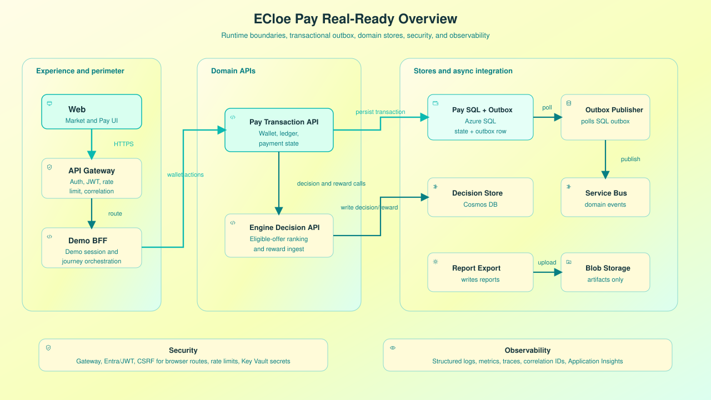
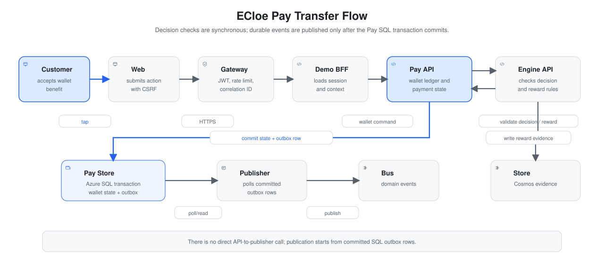
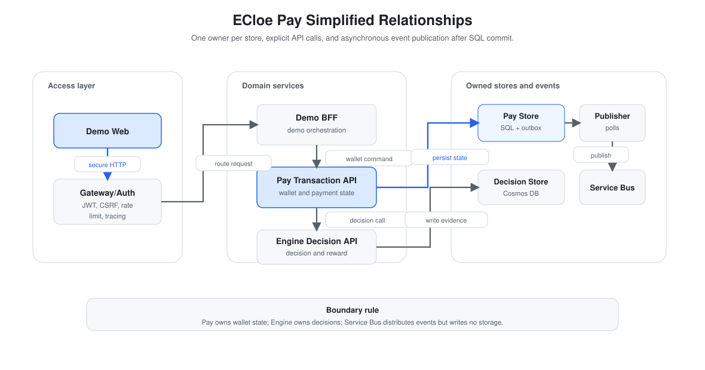

# ECloe Pay - Digital Wallet Surface

## Status

| Area | Status | Notes |
|:---|:---|:---|
| ECloe Pay product surface | Planned for demo | Simulated wallet experience inside the ECloe Demo application. |
| Wallet summary and benefits UI | Implemented | First static demo slice in `src/demo/ecloe_pay/` shows demo balance, cashback, goals, benefits, and accepted-offer status. |
| Offer interaction flow | Implemented | First static demo slice opens, accepts, dismisses, and records deterministic reward-event evidence. |
| Terms of service and demo disclaimer | Implemented | The static demo requires explicit acceptance that no real money is processed and no real user is created. |
| Azure SQL Pay schema | Implemented | `src/demo/ecloe_pay/schema.sql` defines Pay-owned Azure SQL tables under the `ecloe_pay` schema. |
| Reward registration | Implemented | Uses the existing `POST /v1/rewards` endpoint after a verified demo interaction. |
| Real payment account integration | Future | Requires governed upstream wallet, identity, security, compliance, and consent controls. |
| Credit, fraud, risk, compliance, and eligibility decisions | Out of scope | These decisions remain upstream and are not performed by ECloe Pay or ECloe Engine. |

## Purpose

ECloe Pay is the planned digital wallet surface for the ECloe demo. It turns the recommendation returned by ECloe Engine into a customer-facing wallet benefit, then records the customer interaction as an append-only reward event.

In the MVP, ECloe Pay is not a real wallet, bank account, credit product, payment processor, or risk system. It is a simulated experience that demonstrates how wallet context and marketplace behavior can support responsible next-best-action personalization after upstream systems have already decided which offers are eligible.

The first implemented demo slice is available in [`../src/demo/ecloe_pay/`](../src/demo/ecloe_pay/). It is a runnable Flask frontend/API that can also be opened as a static fallback presentation. It includes demo-persona authentication, mandatory demo terms, deterministic simulated-payment confirmation, transaction idempotency evidence, technical mode, and optional Azure SQL persistence for Pay-owned state.

The Flask root route now serves the ECloe Pay landing page, while the runnable wallet demo is available at `/pay`.

## Architecture Diagrams

### Overview



The overview shows the planned ECloe Pay path from the customer-facing demo web app through the BFF, Pay API, Engine API, outbox worker, and low-consumption Azure services.

### Transfer Flow



The transfer flow represents a planned wallet benefit interaction. It uses transactional Pay API persistence and asynchronous event publication before reward evidence reaches the Engine and event stores. It is not real payment processing.

### Simplified Relationship



The simplified relationship diagram separates the customer experience layer, service layer, and state/event layer while preserving the boundary that eligibility remains upstream.

## Product Role

```text
ECloe Market checkout
    -> eligible offers
    -> ECloe Engine decision
    -> ECloe Pay benefit interaction
    -> reward event
    -> future offline evaluation
```

ECloe Pay receives the selected eligible offer from the demo session, presents it as a wallet benefit, and records whether the simulated user opened, dismissed, or accepted it. The reward event is linked to the original `decision_id` returned by ECloe Engine.

## Scope Boundaries

| Responsibility | Owner | Status | Notes |
|:---|:---|:---|:---|
| Wallet UI presentation | ECloe Pay | Planned for demo | Displays simulated wallet balance, benefits, goals, and accepted-offer state. |
| Session state | Demo Backend-for-Frontend | Planned for demo | Keeps persona, cart, decision, reward, and technical timeline state. |
| Eligibility calculation | Upstream eligibility simulator | Planned for demo | Produces allowed `eligible_offers` before calling ECloe Engine. |
| Offer ranking | ECloe Engine | Implemented | Selects one action from the eligible offers sent in the request. |
| Reward ingestion | ECloe Engine | Implemented | Persists append-only reward events through `POST /v1/rewards`. |
| Real account, credit, fraud, risk, compliance decisions | Upstream governed systems | Out of scope | Must not be simulated as Engine or Pay responsibilities. |

## Planned Screens

| Screen | Route | Status | Purpose | Engine dependency |
|:---|:---|:---|:---|:---|
| Wallet home | `/pay` | Planned for demo | Show simulated balance, cashback, goals, recent activity, and active benefit. | Uses prior decision stored in demo session. |
| Benefit details | `/pay/benefits/{offer_id}` | Planned for demo | Explain the selected eligible benefit and allow user action. | Uses `decision_id` from `POST /v1/decisions`. |
| Offer accepted state | `/pay/accepted` | Planned for demo | Confirm the simulated acceptance and reward status. | Calls `POST /v1/rewards`. |
| Wallet empty state | `/pay` | Planned for demo | Show wallet without an accepted recommendation. | No Engine call required. |
| Wallet technical drawer | Inside Pay screens | Planned for demo | Show request ID, decision ID, event ID, policy, artifact, and reward only in technical mode. | Reads session state and Engine responses. |

## Customer-Facing Content

ECloe Pay should use plain wallet language and avoid internal model terminology in customer-facing mode.

| Offer ID | Customer-facing benefit | Allowed message |
|:---|:---|:---|
| `cashback_recurring_purchase` | Cashback for recurring purchases | "Earn cashback on your recurring purchases." |
| `savings_goal` | Savings goal | "Create a goal for your next purchase." |
| `financial_education` | Financial education | "See a short guide before choosing your next benefit." |
| `installment_education` | Installment guidance | "Understand installment options before checkout." |
| `premium_benefit` | Premium wallet benefit | "Review an account benefit available for your wallet profile." |

Customer-facing mode must not display artifact checksums, raw reason codes, proxy campaign names, model internals, hidden eligibility rules, or internal request payloads.

## Technical Mode

Technical mode is for judges, developers, and reviewers. It may show:

- session ID;
- request ID;
- decision ID;
- selected `offer_id`;
- eligible offers considered;
- serving policy;
- policy version;
- artifact version and status;
- simulated purchase likelihood;
- event ID;
- event type;
- reward value;
- request latency;
- fields excluded before calling ECloe Engine.

Any probability shown in ECloe Pay must be labeled as a simulated estimate based on public proxy data, not a real prediction of customer financial behavior.

## Data Contract

ECloe Pay may display simulated wallet state locally, but only minimized context and eligible offers can reach ECloe Engine.

| Data class | ECloe Pay display? | Sent to ECloe Engine? | Status | Notes |
|:---|:---|:---|:---|:---|
| Demo balance | Yes | No | Planned for demo | Simulated local UI value only. |
| Cashback summary | Yes | No | Planned for demo | Presented as demo wallet content. |
| Savings goal progress | Yes | No | Planned for demo | Simulated local UI value only. |
| Recent wallet activity | Yes | No | Planned for demo | Must be synthetic and session-scoped. |
| `channel` | Optional display | Yes | Implemented | Allowed serving field. |
| `history_segment` | Technical mode only | Yes | Implemented | Coarse proxy segment only. |
| `newbie` | Technical mode only | Yes | Implemented | Small categorical serving signal. |
| Eligible offers | Technical mode only | Yes | Implemented | Already allowed by upstream rules. |
| Raw account balance | No | No | Out of scope | Must not be sent to Engine. |
| Direct identifiers | No | No | Out of scope | Demo uses generated session and request IDs. |
| Credit score, income, wealth, fraud, risk, compliance state | No | No | Out of scope | These are upstream governed responsibilities. |

## Decision Integration

ECloe Pay does not request eligibility and does not ask ECloe Engine to invent an offer. It receives the decision created during checkout.

The checkout flow calls:

```http
POST /v1/decisions
Idempotency-Key: demo-session:checkout:interaction
```

Example selected-offer state stored by the planned demo Backend-for-Frontend:

```json
{
  "session_id": "sess_demo_001",
  "request_id": "req_demo_001",
  "decision_id": "dec_demo_001",
  "offer_id": "cashback_recurring_purchase",
  "policy": "likelihood_ranker",
  "policy_version": "likelihood-v1",
  "purchase_likelihood": 0.1375
}
```

ECloe Pay uses this state to render the benefit. It must not create a new decision when the user simply opens the wallet screen.

## Reward Integration

After the simulated user interacts with the benefit, ECloe Pay registers a reward event through the implemented Engine endpoint:

```http
POST /v1/rewards
```

```json
{
  "decision_id": "dec_demo_001",
  "event_id": "evt_demo_001",
  "event_type": "conversion",
  "reward": 1.0,
  "occurred_at": "2026-07-26T12:00:00Z"
}
```

Demo reward mapping:

| User action | Event type | Demo reward | Pay state |
|:---|:---|---:|:---|
| Open benefit | `click` | `0.2` | Benefit viewed. |
| Dismiss benefit | `dismissal` | `0.0` | Benefit dismissed. |
| Accept benefit | `conversion` | `1.0` | Benefit accepted and recorded. |

These values are deterministic demo values. In a real integration, trusted backend services must map verified business events to configured reward values.

After reward acceptance, ECloe Pay may display:

```text
Your interaction was recorded and will be available for future policy evaluation.
```

It must not say that the model retrained immediately, that the next user will instantly receive a different offer, or that the Engine learned online from this single event.

## Demo Journey

| Step | Area | Status | Behavior |
|:---|:---|:---|:---|
| 1 | ECloe Market | Planned for demo | User adds an item to cart and reaches checkout. |
| 2 | Eligibility simulator | Planned for demo | Demo layer produces eligible wallet benefits. |
| 3 | ECloe Engine | Implemented | Engine ranks eligible offers and returns one selected offer. |
| 4 | ECloe Pay | Planned for demo | Wallet shows the selected benefit. |
| 5 | ECloe Pay | Planned for demo | User opens, dismisses, or accepts the benefit. |
| 6 | ECloe Engine | Implemented | Reward event is appended and linked to the original decision. |
| 7 | ECloe Control Room | Planned for demo | Technical timeline shows decision and reward evidence. |

## Azure Direction

The current repository documents a low-consumption Azure target architecture for the Engine and event storage. ECloe Pay should follow the same low-cost direction when implemented:

| Concern | MVP direction | Notes |
|:---|:---|:---|
| Frontend hosting | Azure Static Web Apps or App Service | Future demo UI hosting option. |
| Runtime integration | Demo Backend-for-Frontend | Aggregates session state and calls ECloe Engine. |
| Decision and reward events | Cosmos DB Serverless or Azure SQL Database serverless | Must preserve idempotency and append-only reward behavior. |
| Pay transactional state | Azure SQL Database | Dedicated `ecloe_pay` schema owns demo sessions, wallet snapshots, payment orders, benefit interactions, and outbox events. |
| Pay artifact bucket | Azure Blob Storage | Dedicated `ecloe-pay-demo-artifacts` bucket stores only demo-safe Pay evidence such as simulated receipts or screenshots. |
| Secrets | Azure Key Vault | Keeps API credentials and service configuration outside code. |
| Observability | Application Insights | Tracks UI actions, Engine latency, failures, and fallback mode without logging sensitive context. |

These are target architecture notes, not deployed infrastructure in the current repository.

## Acceptance Criteria

ECloe Pay is ready for the planned demo when:

- wallet screens use only synthetic session data;
- checkout decision state is reused instead of creating duplicate decisions;
- accepted, dismissed, and clicked benefits create deterministic reward events;
- customer-facing mode hides internal policy and artifact details;
- technical mode exposes request, decision, reward, and policy evidence;
- the UI never claims credit approval, eligibility approval, fraud detection, risk decisions, or immediate online learning;
- fallback presentation mode works when the local Engine API is unavailable.

## Implemented Static Demo Slice

The initial implementation lives in:

```text
src/demo/ecloe_pay/
```

Files:

| File | Purpose |
|:---|:---|
| `app.py` | Flask app with landing, wallet, session, terms, simulated payment, reset, and benefit interaction routes. |
| `landing.html` | ECloe Pay landing page explaining the simulated product, secure demo flow, private bucket, and Azure SQL ownership. |
| `index.html` | ECloe Pay wallet, benefit, activity, security, and terms UI. |
| `styles.css` | Responsive kawaii-inspired visual system for the static demo. |
| `app.js` | Browser client for Flask APIs, plus static fallback state, terms gate, simulated transaction validation, idempotency guard, and reward-event evidence. |
| `schema.sql` | Pay-owned Azure SQL `ecloe_pay` schema and dedicated Pay bucket record. |
| `repository.py` | Memory and Azure SQL repository implementations for simulated Pay state. |

The static slice deliberately does not create users, collect credentials, store real payment data, or call external financial services.

Run locally:

```powershell
.venv\Scripts\python.exe -m flask --app src.demo.ecloe_pay.app run --host 127.0.0.1 --port 5000
```

Create the dedicated private Azure Blob container:

```powershell
.\scripts\create_ecloe_pay_bucket.ps1
```

## Related Documentation

- [`demo-interface.md`](demo-interface.md) - Full planned ECloe Demo interface.
- [`api-contract.md`](api-contract.md) - Implemented Engine API payloads and validation rules.
- [`marketplace-finance-use-case.md`](marketplace-finance-use-case.md) - Practical marketplace-wallet scenario.
- [`cloud-setup.md`](cloud-setup.md) - Current low-consumption Azure storage setup.
- [`ecloe-pay-overview.svg`](ecloe-pay-overview.svg) - ECloe Pay overview diagram.
- [`ecloe-pay-transfer-flow.svg`](ecloe-pay-transfer-flow.svg) - ECloe Pay transfer flow diagram.
- [`ecloe-pay-simplified-relationship.svg`](ecloe-pay-simplified-relationship.svg) - ECloe Pay simplified relationship diagram.
