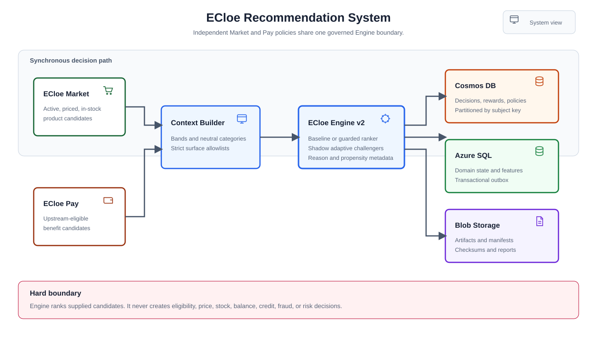
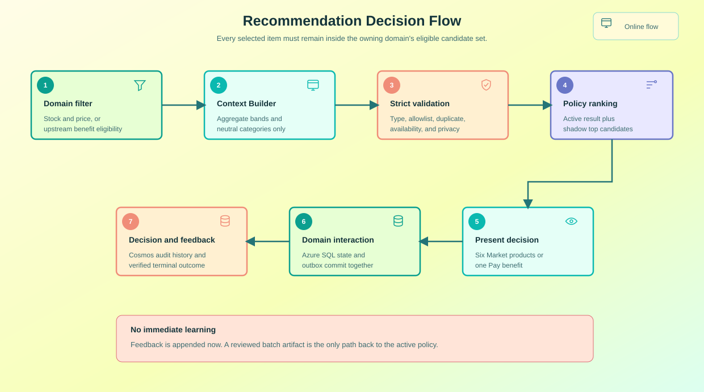
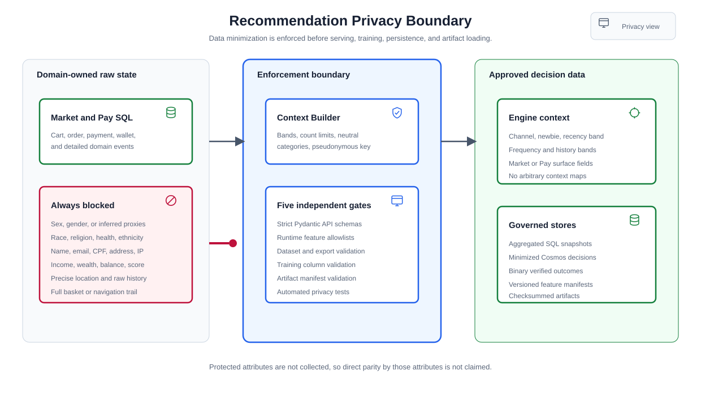
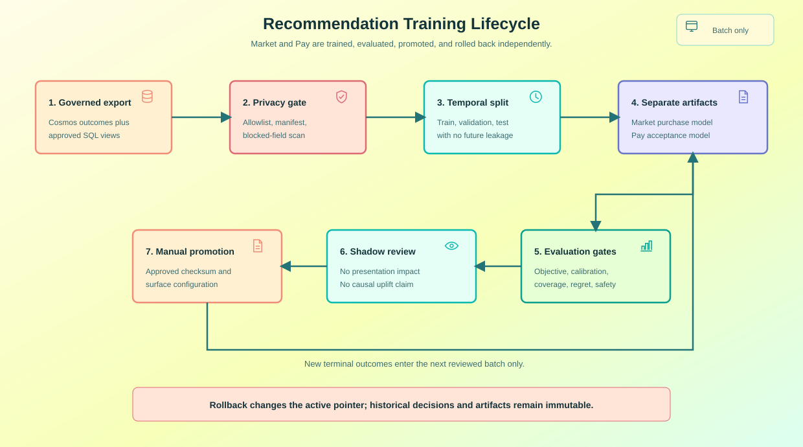

# ECloe Recommendation System

## Purpose

This document is the implementation and operating specification for product recommendations in ECloe Market and benefit recommendations in ECloe Pay. Both surfaces use ECloe Engine, but they have independent objectives, candidates, policies, evidence, artifacts, and rollback controls.

The first production-shaped release is deliberately conservative:

- Market ranks only products that are active, priced, and in stock.
- Pay ranks only benefits that an upstream owner has already declared eligible.
- The deterministic baseline is the serving default.
- The likelihood ranker is promotable only after minimum evidence and review.
- Epsilon-Greedy, UCB1, and Thompson Sampling run as shadow challengers only.
- Feedback is recorded immediately, but policies change only through reviewed batch releases.
- Sex, gender, and inferred proxies are excluded from collection and decisioning.

## Implementation Status

| Capability | Status | Evidence |
|:---|:---|:---|
| Shared typed recommendation core | Implemented | `src/recommendation/` |
| Deterministic Market and Pay policies | Implemented | `RecommendationService`, configurable per surface |
| Likelihood estimates with Bayesian smoothing | Implemented | `LikelihoodRanker`, `alpha=2`, minimum 10 samples |
| Epsilon-Greedy, UCB1, and Thompson challengers | Implemented | Seeded shadow rankings, no online policy updates |
| Strict v2 decision, estimate, feedback, and policy APIs | Implemented | `src/api/routers/recommendations.py` |
| Market recommendation shelf and telemetry | Implemented | `/market` and Market feedback API |
| Pay Engine-selected benefit | Implemented | `/api/session` assigns and exposes a real Engine decision |
| Market cart, checkout, pending order, and SQL outbox persistence | Implemented | Memory and Azure SQL repositories |
| Neutral Hillstrom import adapter | Implemented | `src/data/legacy_hillstrom.py` |
| Deterministic local synthetic seed | Implemented | `scripts/seed_recommendation_data.py` |
| Azure SQL feature schema | Implemented | `src/recommendation/schema.sql` |
| Populate shared Azure SQL with the synthetic seed | Planned for demo | Requires explicit preflight and `--apply-azure-sql` |
| Cosmos v2 decision, reward, and policy operational dashboards | Planned for demo | Repository fields exist; dashboards are not part of this change |
| Blob artifact publishing and manual promotion record | Planned for demo | Existing artifact container settings will be reused |
| Canary serving for adaptive policies | Future | Maximum exploration rate will be `0.05` |
| Collaborative filtering and user embeddings | Out of scope | Not needed for the first governed release |
| Credit, risk, fraud, pricing, or eligibility decisions | Out of scope | Must remain in governed upstream systems |

## Objectives and Boundaries

### Market objective

Rank up to six eligible products to maximize a verified product purchase within 24 hours of the recommendation. The initial adaptive experiment affects only position one. Remaining positions stay deterministic until a slate policy is explicitly designed and evaluated.

### Pay objective

Select exactly one eligible wallet benefit to maximize verified acceptance in the current Pay session.

### Engine boundary

ECloe Engine:

- receives typed candidates and minimized aggregate context;
- filters only technical availability and candidate type;
- ranks candidates already supplied by the owning domain;
- returns scores, confidence, propensity metadata, reason codes, policy, and artifact metadata;
- records decisions and verified feedback through its repository boundary.

ECloe Engine never:

- queries Market or Pay transaction tables during a decision;
- creates product availability or benefit eligibility;
- changes prices, inventory, balances, limits, risk scores, or payment state;
- accepts a client-provided reward value;
- updates the online policy immediately after feedback.

## Architecture



The synchronous path is intentionally short. A domain filters candidates, builds a minimized context, calls Engine, and presents the result. SQL interactions and outbox rows remain owned by Market or Pay. Cosmos DB owns recommendation decision and outcome history. Blob Storage owns immutable, checksummed artifacts and evaluation reports.

### Decision sequence



1. Market filters products by active state, current price, and stock, or Pay receives eligible benefits from upstream rules.
2. Context Builder converts raw domain events into approved bands and neutral categories.
3. Strict Pydantic models reject unknown fields and blocked attributes.
4. Engine verifies candidate type, availability, duplicate IDs, stock, limit, and context allowlists.
5. The active policy ranks candidates; shadow challengers rank the same candidate set without affecting presentation.
6. Market presents up to six products; Pay presents one benefit.
7. Domain interactions are committed to Azure SQL with an outbox row where applicable.
8. Engine decisions and terminal outcomes are stored in Cosmos DB.
9. Batch training exports approved records and creates a candidate artifact for manual review.

## Public API v2

All business routes retain the existing authentication and scope boundary. API v1 remains available for legacy offer decisions.

### `POST /v2/decisions`

Required scope: `decision:write`.

Market request:

```json
{
  "request_id": "req_market_20260811_001",
  "surface": "market",
  "decision_point": "market_home",
  "customer_context": {
    "channel": "Web",
    "newbie": 1,
    "recency_band": "recent",
    "frequency_band": "low",
    "history_segment": "low",
    "category_affinities": ["apparel"],
    "cart_size_band": "empty",
    "cart_value_band": "low"
  },
  "eligible_candidates": [
    {
      "candidate_id": "prd_demo_0001",
      "candidate_type": "product",
      "available": true,
      "category_id": "beauty",
      "price_band": "low",
      "stock_band": "high",
      "popularity_band": "high",
      "priority": 40,
      "new_item": false
    }
  ],
  "limit": 6
}
```

Pay request:

```json
{
  "request_id": "req_pay_20260811_001",
  "surface": "pay",
  "decision_point": "wallet_benefit",
  "customer_context": {
    "channel": "Web",
    "newbie": 0,
    "wallet_engagement_band": "medium",
    "benefit_response_band": "unknown",
    "savings_goal_active": true
  },
  "eligible_candidates": [
    {
      "candidate_id": "cashback_recurring_purchase",
      "candidate_type": "benefit",
      "available": true,
      "benefit_type": "cashback",
      "priority": 30
    }
  ],
  "limit": 1
}
```

Decision response:

```json
{
  "request_id": "req_market_20260811_001",
  "decision_id": "dec_...",
  "surface": "market",
  "decision_point": "market_home",
  "created_at": "2026-08-11T12:00:00+00:00",
  "ranked_candidates": [
    {
      "candidate_id": "prd_demo_0001",
      "candidate_type": "product",
      "rank": 1,
      "score": 1.25075,
      "confidence": "deterministic",
      "selection_probability": 1.0,
      "reason_codes": ["business_priority", "stable_tiebreak"]
    }
  ],
  "policy": "deterministic_baseline",
  "policy_version": "recommendation-v2",
  "artifact_schema": "recommendation_policy.v2",
  "artifact_version": "market-recommendation-v2",
  "artifact_checksum": "<sha256>",
  "artifact_status": "active",
  "warnings": []
}
```

`Idempotency-Key` is optional but recommended. Reusing a key with a different body is rejected.

### `POST /v2/likelihood-estimates`

Required scope: `decision:read`. Uses the same typed request and returns estimates for every valid candidate without creating a decision.

### `POST /v2/feedback`

Required scope: `reward:write`. The caller identifies a presented candidate and event; it cannot send a reward value.

```json
{
  "decision_id": "dec_...",
  "event_id": "evt_market_purchase_001",
  "candidate_id": "prd_demo_0001",
  "position": 1,
  "event_type": "purchase",
  "occurred_at": "2026-08-11T13:00:00+00:00"
}
```

Validation requires a timezone, a decision owned by the authenticated subject, and an exact candidate and position from the recorded slate. Reusing an event ID with different feedback is rejected.

### `GET /v2/policies/current?surface=market|pay`

Required scope: `policy:read`. Returns the effective active policy, policy and artifact versions, shadow challengers, shadow mode, and manual promotion mode.

## Feature Catalog

The machine-readable manifest is `src/recommendation/feature_manifest.json`.

### Common context

| Feature | Type | Meaning | Source rule |
|:---|:---|:---|:---|
| `surface` | enum | Market or Pay artifact boundary | Request metadata, not inferred |
| `decision_point` | string | Named journey location | Controlled application constant |
| `channel` | enum | Web, Phone, or Multichannel | Coarse channel only |
| `newbie` | binary | Coarse new-user indicator | Aggregated domain state |
| `recency_band` | string | Recent, established, or dormant | Derived before Engine |
| `frequency_band` | string | Low, medium, or high | Derived before Engine |
| `history_segment` | string | Coarse behavior history | No raw monetary history |

### Market context and candidate features

| Feature | Location | Meaning |
|:---|:---|:---|
| `category_affinities` | Context | At most three neutral category IDs |
| `cart_size_band` | Context | Empty, small, medium, or large |
| `cart_value_band` | Context | Coarse cart value band |
| `category_id` | Candidate | Neutral product category |
| `price_band` | Candidate | Coarse current price band |
| `stock_band` | Candidate | None, low, medium, high, or very high |
| `popularity_band` | Candidate | None, low, medium, high, or very high |
| `priority` | Candidate | Controlled commercial priority, 0 to 100 |
| `new_item` | Candidate | New-product indicator |

Product categories that contain gender-coded terms are converted to `apparel` before modeling. They are never used to infer a user attribute.

### Pay context and candidate features

| Feature | Location | Meaning |
|:---|:---|:---|
| `wallet_engagement_band` | Context | Coarse wallet interaction level |
| `benefit_response_band` | Context | Coarse prior response level |
| `savings_goal_active` | Context | Whether a demo savings objective is active |
| `benefit_type` | Candidate | Controlled type such as cashback, savings, or education |
| `priority` | Candidate | Upstream configured ordering priority |

### Technical identifiers

`subject_key`, `request_id`, `decision_id`, and `event_id` support correlation, idempotency, and audit. They are never model features. `subject_key` is pseudonymized before storage.

## Privacy and LGPD Controls



The system does not collect, infer, store as features, or use sex or gender in a recommendation decision. This is a data-minimization and purpose-limitation control. It is not a claim that ignoring one field alone guarantees legal compliance or eliminates every source of bias.

### Blocked attributes

- Sex, gender, and all derived or proxy versions.
- Race, ethnicity, religion, and health.
- Name, email, phone, CPF, address, postal code, precise location, and full IP.
- Income, wealth, balance, credit score, and raw monetary history.
- Full basket contents and detailed navigation history as model context.
- Any inference of gender from a name, viewed item, category, image, or language.

### Enforcement layers

1. Ingestion maps source-only Hillstrom treatment labels to neutral arms.
2. Processed datasets omit blocked source columns.
3. Dataset validation fails when a blocked column is present.
4. Strict Pydantic models reject unknown API fields.
5. Service allowlists reject non-approved context keys even when called without HTTP.
6. Category normalization prevents gender-coded category affinity.
7. Export validation rejects blocked fields before writing training CSVs.
8. Training rejects blocked columns.
9. Artifact loading rejects blocked or non-allowlisted context manifests.
10. Tests scan the source boundary and exercise rejected API payloads.

Because sex and gender are not collected, the system cannot and must not claim direct parity measurement by those attributes. Monitoring is limited to non-protected operational cohorts such as surface, decision point, channel, cold-start state, coverage, and stock eligibility. A future protected-attribute fairness study would require a separate legal basis, access controls, purpose, retention policy, and review outside the serving feature path.

## Algorithms

### Deterministic baseline

**Inputs:** eligible candidates, availability, priority, popularity band, stock band, and stable candidate ID.

**Calculation:**

```text
score = priority * 0.01 + popularity_score + stock_score * 0.001
```

Candidates sort by descending score and ascending `candidate_id` for a stable tie-break. Pay relies primarily on configured priority because stock and popularity are Market concepts.

**Example:** two products have the same priority and popularity. The one with higher stock receives a small deterministic advantage. If all values tie, `prd_a` precedes `prd_b`.

**Reason codes:** `business_priority`, `stable_tiebreak`.

**Fallback:** this policy is itself the final fallback.

**Risks:** commercial priority can over-concentrate exposure. Coverage and candidate concentration must be monitored.

**Market role:** initial serving policy and stable positions two through six during early bandit experiments.

**Pay role:** initial ordering among already eligible benefits.

### Content affinity

**Inputs:** neutral `category_affinities`, candidate category, and baseline score.

**Calculation:** exact match receives `1.0`; a small baseline component preserves stable ordering.

```text
score = category_match + baseline_score * 0.01
```

**Example:** an anonymous visitor filters to `beauty`; beauty products rank above unrelated categories without identifying the visitor.

**Reason codes:** `content_affinity`, `cold_start_popularity`.

**Fallback:** baseline popularity and priority when no affinity matches.

**Risks:** category loops can reduce discovery. Limit affinity inputs and monitor category coverage.

**Market role:** anonymous and low-evidence cold start.

**Pay role:** not used in the initial release.

### Likelihood ranker

**Inputs:** verified binary outcomes aggregated by full context, reduced context, candidate, category, and surface-wide totals.

**Calculation:** Bayesian-smoothed binary rate with `alpha=2`:

```text
smoothed_rate = (successes + alpha * global_rate) / (count + alpha)
```

Confidence is low below 10 samples, medium from 10 to 49, and high from 50 samples. The serving guardrail requires at least 1,000 decisions and 100 positives per surface before this policy can replace the baseline.

**Fallback hierarchy:** full context, reduced context, channel context, candidate, category, content affinity, global rate, deterministic baseline.

**Example:** a product has 7 purchases in 10 exposures while the surface global rate is 0.20. Its smoothed estimate is `(7 + 2 * 0.20) / 12 = 0.6167`.

**Reason codes:** `contextual_conversion_rate`, `reduced_context_conversion_rate`, `channel_conversion_rate`, `candidate_conversion_rate`, `category_conversion_rate`, `content_affinity`, `global_conversion_rate`, `context_fallback`, `cold_start_fallback`.

**Risks:** selection bias, delayed outcomes, small cohorts, and poor calibration. Use temporal evaluation, propensity metadata, smoothing, and baseline guardrails.

**Market role:** estimates probability of verified product purchase.

**Pay role:** estimates probability of eligible benefit acceptance.

### Epsilon-Greedy

**Inputs:** current likelihood ranking, eligible candidates, request ID, and epsilon.

**Calculation:** choose the current best candidate with probability `1 - epsilon`; otherwise move a seeded random eligible candidate to position one. Shadow uses `epsilon=0.10`. A future canary must use at most `0.05`.

**Example:** with three products and `epsilon=0.10`, about 10 percent of first-position shadow decisions explore another product over a sufficiently large sample.

**Reason codes:** base reason codes plus `exploration_epsilon` when exploration occurs.

**Fallback:** likelihood ranker, then its hierarchy.

**Risks:** avoidable exposure to weaker candidates, unstable small-sample conclusions, and concentration if the best estimate is noisy.

**Market role:** position-one challenger only.

**Pay role:** challenger within eligible benefits only.

### UCB1

**Inputs:** per-candidate successes and counts, total candidate observations, and confidence `2.0`.

**Calculation:**

```text
ucb = mean_reward + sqrt(2.0 * log(total_observations) / candidate_count)
```

Unseen candidates receive a high uncertainty bonus in shadow evaluation.

**Example:** a benefit with lower mean but few observations may outrank a well-known benefit because its uncertainty bonus is larger.

**Reason codes:** `ucb_uncertainty`.

**Fallback:** unseen-candidate bonus, then stable candidate ID tie-break.

**Risks:** excessive preference for sparse candidates and misleading confidence when traffic is non-stationary.

**Market role:** shadow challenger for the first position.

**Pay role:** shadow challenger among eligible benefits.

### Thompson Sampling

**Inputs:** successes and failures per candidate, request ID, and prior `Beta(1,1)`.

**Calculation:** sample once per candidate:

```text
sample ~ Beta(1 + successes, 1 + failures)
```

The candidate with the highest seeded sample ranks first.

**Example:** two benefits with similar acceptance history receive different samples for a request, allowing uncertainty-aware exploration while remaining reproducible for the same request ID and artifact.

**Reason codes:** `thompson_sample`.

**Fallback:** prior `Beta(1,1)` when a candidate has no evidence.

**Risks:** sensitivity to reward quality, delayed outcomes, non-stationarity, and incorrect propensity analysis if implementation metadata is missing.

**Market role:** primary adaptive candidate for position one after shadow and canary review.

**Pay role:** primary adaptive candidate among already eligible benefits.

## Cold Start

| Situation | Behavior |
|:---|:---|
| New subject, known Market category | Content affinity plus deterministic availability and popularity |
| New subject, no category signal | Deterministic baseline |
| New product | Priority, stock, new-item flag, and controlled shadow exploration |
| New Pay subject | Eligible-benefit priority |
| New Pay benefit | Configured priority and shadow uncertainty bonus |
| Missing or invalid evidence artifact | Deterministic baseline and warning |

No cold-start path introduces identity, raw history, or inferred protected attributes.

## Feedback and Reward Attribution

### Market

| Event | Terminal | Reward | Use |
|:---|:---:|:---:|:---|
| `impression` | No | None | Telemetry |
| `click` | No | None | Telemetry |
| `add_to_cart` | No | None | Telemetry |
| `purchase` within 24 hours | Yes | 1 | Primary objective |
| `expired` after attribution window | Yes | 0 | Primary objective |

### Pay

| Event | Terminal | Reward | Use |
|:---|:---:|:---:|:---|
| `impression` | No | None | Telemetry |
| `open` | No | None | Telemetry |
| `acceptance` in session | Yes | 1 | Primary objective |
| `rejection`, `dismissal`, or `expired` | Yes | 0 | Primary objective |

Only a trusted backend with `reward:write` may submit terminal outcomes. Market purchase feedback must be derived from an authoritative paid-order transition; Pay acceptance must be derived from the Pay session state. The public browser never sets numeric reward values.

## Persistence

### Azure SQL ownership

`ecloe_market` owns catalog, inventory, carts, checkout sessions, orders, recommendation interactions, and outbox events. Checkout and order creation revalidate current prices and inventory and write outbox evidence in the same transaction.

`ecloe_pay` owns demo sessions, wallet and payment state, benefit interactions, and outbox events. It stores the Engine-returned decision and selected benefit instead of a fixed placeholder.

`ecloe_features` owns only approved pseudonymous feature snapshots, deterministic seed runs, and synthetic interactions. It does not own transaction truth.

### Cosmos DB ownership

| Container | Partition | Content |
|:---|:---|:---|
| `decisions` | `/customer_id` compatibility path | Minimized context, eligible candidate IDs, ranking, propensity, policy, artifact; the partition value is the pseudonymous `subject_key` |
| `rewards` | `/customer_id` compatibility path | Idempotent feedback linked to decision, candidate, position, and outcome; the partition value is the pseudonymous `subject_key` |
| `policy_versions` | governed policy key | Metrics, manifests, approval status, promotion, and rollback metadata |

### Blob Storage ownership

The artifact container stores immutable Market and Pay artifacts, SHA-256 checksums, feature manifests, evaluation reports, and the promoted policy pointer. Market and Pay artifacts are never interchangeable.

## Deterministic Synthetic Seed

Default generation parameters:

```text
seed=42
subjects=250
market_interactions=10000
pay_interactions=3000
data_origin=synthetic_seed
```

Generate local JSONL and manifest files:

```bash
python scripts/seed_recommendation_data.py
```

Small verification run:

```bash
python scripts/seed_recommendation_data.py \
  --subjects 10 \
  --market-interactions 40 \
  --pay-interactions 20 \
  --output-dir reports/recommendation_seed_check
```

IDs and checksums are deterministic for the same seed, counts, and catalog. SQL inserts use stable primary keys and existence checks. The cloud write is intentionally explicit:

```bash
python scripts/seed_recommendation_data.py --apply-azure-sql
```

Do not run the cloud command until the preflight in this document passes.

## Training Lifecycle



1. Export decisions and terminal rewards from Cosmos DB.
2. Join only approved aggregate SQL views using pseudonymous correlation.
3. Reject blocked columns and validate the feature manifest.
4. Split chronologically into train, validation, and test periods.
5. Exclude `subject_key`, technical IDs, and any event after decision time from features.
6. Train Market and Pay artifacts independently.
7. Evaluate objective, calibration, ranking, coverage, concentration, regret, and exploration.
8. Produce a checksummed artifact, manifest, and evaluation report.
9. Run shadow replay and operational guardrails.
10. Require manual promotion; retain the prior approved artifact for rollback.

No feedback event mutates serving state synchronously. Batch retraining is the only policy update path.

## Evaluation

### Data split

Use chronological windows, not random row splitting, for v2 Market and Pay artifacts. All feature timestamps must be less than or equal to decision time. Keep subjects grouped where needed to avoid repeated-subject leakage.

### Metrics

| Metric | Market | Pay | Purpose |
|:---|:---:|:---:|:---|
| Verified conversion rate | Yes | No | Primary Market objective |
| Verified acceptance rate | No | Yes | Primary Pay objective |
| Brier score and calibration curve | Yes | Yes | Probability quality |
| NDCG@K | Yes | Optional | Product ranking quality |
| Candidate coverage | Yes | Yes | Avoid narrow exposure |
| Exposure concentration | Yes | Yes | Detect dominance |
| Cumulative regret | Yes | Yes | Compare adaptive challengers |
| Exploration rate | Yes | Yes | Verify configured behavior |
| Eligibility violations | Yes | Yes | Must be zero |
| Out-of-stock selections | Yes | No | Must be zero |
| Blocked fields | Yes | Yes | Must be zero |

### Promotion gates

A candidate policy remains unpromoted unless all conditions pass:

- at least 1,000 decisions and 100 positive terminal outcomes for its surface;
- 100 percent of selected candidates were in the supplied eligible set;
- zero Market products without current stock;
- zero blocked fields in data, manifest, and artifact;
- no temporal leakage;
- the 95 percent bootstrap interval does not indicate regression on the primary objective;
- calibration and coverage are acceptable against the baseline;
- shadow stability, latency, and error guardrails pass;
- a human approver records the decision.

Shadow mode validates ranking stability, eligibility, latency, coverage, and implementation correctness. It does not establish causal uplift.

## Promotion and Rollback

The effective serving policy is configured independently:

```text
RECOMMENDATION_MARKET_POLICY=deterministic_baseline
RECOMMENDATION_PAY_POLICY=deterministic_baseline
```

Allowed values are `deterministic_baseline` and `likelihood_ranker`. Even when the likelihood policy is requested, the runtime guardrail falls back to baseline until minimum evidence is present.

Promotion procedure:

1. Freeze the training snapshot and artifact checksum.
2. Attach evaluation, feature manifest, privacy validation, and shadow report.
3. Record an approver and release note in `policy_versions`.
4. Change only the target surface configuration.
5. Deploy and verify policy metadata through `/v2/policies/current`.
6. Monitor errors, latency, objective lag, coverage, and concentration.

Rollback procedure:

1. Set the affected surface back to `deterministic_baseline` or the last approved artifact pointer.
2. Redeploy configuration without deleting historical decisions.
3. Verify the effective policy endpoint and a synthetic decision.
4. Record trigger, timestamp, affected policy, and investigation owner.

## Azure Population Preflight

Before writing the deterministic seed to Azure SQL:

1. Confirm the target server and database are the intended non-production demo resources.
2. Confirm managed identity or approved local Entra authentication.
3. Apply `src/market/infrastructure/schema.sql`, `src/demo/ecloe_pay/schema.sql`, and `src/recommendation/schema.sql` in a transaction-aware migration process.
4. Generate the seed locally twice and compare checksums.
5. Run all privacy, API, repository, training, and artifact tests.
6. Capture pre-load row counts by seed run ID.
7. Run `scripts/seed_recommendation_data.py --apply-azure-sql` once.
8. Verify 250 subjects, 10,000 Market interactions, 3,000 Pay interactions, stable IDs, and the expected checksum.
9. Re-run the command and confirm counts do not increase.
10. If validation fails, delete only rows linked to the exact `seed_run_id` in foreign-key order and retain the manifest as incident evidence.

The implementation does not automatically populate Cosmos DB. Decision and reward import into Cosmos remains a separate reviewed operation so operational decision history cannot be confused with SQL seed data.

## Monitoring and Alerts

Monitor per surface and policy version:

- request count, validation failures, latency, and server errors;
- candidate count, empty candidate failures, and eligibility violations;
- baseline fallback and cold-start rates;
- candidate and category coverage;
- exposure concentration by decision point;
- terminal outcome delay and expiration rate;
- conversion or acceptance with confidence intervals;
- calibration drift after sufficient labels;
- artifact checksum and policy configuration mismatches;
- outbox backlog, publication failures, and duplicate event rate.

Alert immediately on any blocked field, out-of-eligible-set selection, out-of-stock selection, artifact validation failure, or inability to roll back.

## Test Matrix

| Layer | Required checks |
|:---|:---|
| Privacy | Blocked API fields, unknown context, neutral category mapping, dataset and artifact rejection |
| Algorithms | Dynamic candidates, deterministic seeds, tie-breaks, cold start, hierarchy, candidate containment |
| API | v1 compatibility, v2 contracts, scopes, idempotency, slate-bound feedback, server reward mapping |
| Market | stock filter, recommendation shelf, cart, checkout, pending order, outbox persistence contract |
| Pay | Engine-created decision, single eligible benefit, backend event mapping, reset and payment idempotency |
| Data | seed counts, stable IDs, checksum, origin marker, SQL idempotency |
| Training | temporal split, no leakage, separate artifacts, manifest validation |
| Documentation | links, SVG structure, status vocabulary, examples, and boundary consistency |

## Limitations

- Current runtime evidence is in-memory unless an approved artifact loader is supplied.
- Shadow results are implementation evidence, not causal evidence.
- The Market demo records intermediate recommendation telemetry; paid-order attribution still requires an authorized integration event.
- The Pay demo is synthetic and does not process real money.
- Direct fairness parity by sex or gender is not measured because those attributes are not collected.
- Delayed rewards, policy bias, and non-stationarity require careful offline analysis before adaptive promotion.
- A position-one bandit does not optimize the full six-product slate.

## Roadmap

| Step | Status | Exit condition |
|:---|:---|:---|
| Baseline serving and v2 contracts | Implemented | Typed decisions and verified feedback work locally |
| Deterministic SQL seed | Implemented | Local files and SQL apply command are reproducible |
| Azure demo population | Planned for demo | Counts, checksum, repeat-run idempotency, rollback evidence |
| Batch Market and Pay artifact builders | Planned for demo | Independent temporal evaluation reports |
| Shadow operational run | Planned for demo | Eligibility, coverage, latency, and stability pass |
| Likelihood promotion | Future | Minimum evidence and non-regression gates pass |
| Adaptive canary | Future | Manual approval and exploration at or below 0.05 |
| Full slate optimization | Out of scope | Requires a separate design and evaluation protocol |
